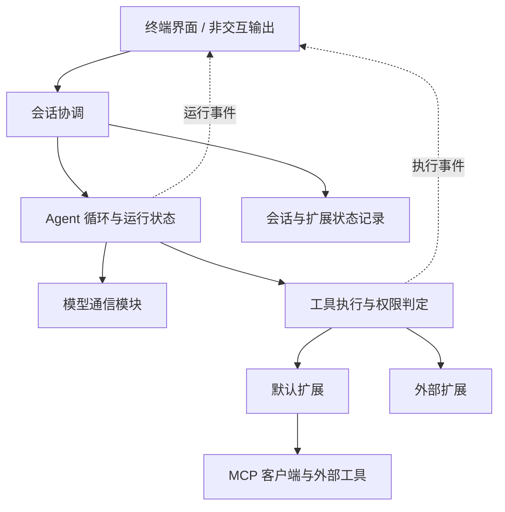

# 从 Pi 源码到可扩展 TUI Agent：学习与开发计划

后续 Agent 接手规则：[协作引导](agent-coordination-guide.md)。

研究日期：2026-09-16。源码基线：`60e7e76bd7ea25cad1dd6f3f1ce0d18814a42759`。
实现语言已确定为 TypeScript，交互优先 TUI。本文是开发建议和执行清单；勾选状态以当前项目中的实际验收结果为准。
“默认继承”按“随产品集成、按需配置的默认扩展”处理，不采用类继承组织插件。

## 当前进度与学习节奏

进度更新：2026-09-28。阶段 0～7 已完成所记录基础范围的本地验收。阶段 8 已完成独立本地 stdio 演示服务、宿主注册接入，以及独立 Streamable HTTP 测试服务的握手、工具发现、调用和关闭验收；本机 HTTP 工具已接入宿主并通过本地模拟验收；MCP 调用中取消、故障诊断与失败清理已按记录范围验收；resources/prompts 的用户选择入口已完成本地验收；受限网页读取实现及独立脚本已复验通过，tests/web.mjs 已纳入 npm test 并通过完整复验；Tavily 搜索实现及模拟测试已通过；下一节点为恶意外部内容与权限联合验收。

搜索提供商 Tavily 已接入；用户报告实测成功，本次独立复验使用模拟响应，未调用真实 API。

教学顺序与授权规则见 [协作引导](agent-coordination-guide.md#教学方式)。本文件集中维护路线、勾选和下一节点。

2026-09-28 接手复验通过；用户确定先用显式开关启用仓库内 MCP 演示服务，程序与参数固定沿用现有实现。
stdio 与 HTTP 宿主接入已实现；阶段 8 整体未完成。启用约定与验证边界见[当前交接](agent-handoff.md)。

### 阶段总览

- [x] 阶段 0：掌握这条链路需要的 TypeScript。
- [x] 阶段 1：完全不依赖真实模型的 Agent 循环。
- [x] 阶段 2：真实流式模型与可靠取消。
- [x] 阶段 3：把核心接入真正的 TUI。
- [x] 阶段 4：会话保存、恢复和运行诊断。
- [x] 阶段 5：建立可验证的扩展机制。
- [x] 阶段 6：形成默认工作流，而不只是一套插件接口。
- [x] 阶段 7：Skills、上下文压缩、项目记忆与分支。
- [ ] 阶段 8：MCP 与网络信息能力默认集成。
- [ ] 阶段 9：子代理、后台任务与可发布产品。

阶段总览只有在该阶段的交付物和全部验收项都通过后才勾选；当前阶段 0 至阶段 7 已完成所记录范围的本地验收；阶段 3 当前采用 readline 与 ANSI 渲染，尚未接入 Pi TUI。

## 1. 最终交付目标

做一个本地运行的 Agent：具备 Pi 式工具循环、流式 TUI、会话恢复和扩展机制，
同时开箱提供计划、待办、用户提问、权限确认、Skills、上下文管理、项目记忆、
网页读取、搜索接入、MCP、受控子代理、后台任务及运行诊断。

采用“稳定核心 + 默认扩展 + 外部扩展”的组合。默认扩展随安装包交付，不要求用户自行拼装。
联网服务和模型仍需用户配置；内置能力不等于自动授权、自动联网或自动创建子代理。

完成标准：

1. 安装后配置一个模型即可完成流式对话、调用工具、查看结果和恢复会话。
2. 不修改核心源码，能增加一个工具、一个命令、一个事件处理器和一个 TUI 展示。
3. 同一个扩展可作为内置扩展或外部扩展加载，关闭后不残留工具、监听器或后台进程。
4. 所有宿主管理的工具调用经过统一参数校验、权限判定、取消和日志处理。
5. 计划、任务与记忆有可查看的结构化状态，不能仅依靠模型说“完成了”。
6. 通过固定的端到端场景验证最终产品；用真实模型验证行为，用模拟模型验证确定性逻辑。

业务接入在这些基础能力稳定后进行。现阶段使用临时文件、公开文档和本地测试服务。

## 2. 调查结论：哪些来自 Pi，哪些是我们的新增设计

| 结论 | 证据 | 对本项目的意义 |
| --- | --- | --- |
| Pi 已拆分模型接入、Agent、编码会话与 TUI | 根 README、SDK 组装代码 [S1][S2] | 参考职责划分，初期一个包内分模块即可 |
| Agent 循环消费模型输出，校验执行工具并回填结果 | `agent-loop.ts` [S3] | 核心循环自己实现，作为学习主线 |
| Agent 状态与完整会话协调分开 | `agent.ts`、`agent-session.ts` [S4][S5] | 分开运行状态、持久记录与界面状态 |
| 当前扩展通过 jiti 在宿主进程加载，注册到集合后绑定运行能力 | `extensions/loader.ts` [S6] | 使用函数组合，不需要插件继承层级 |
| 默认与外部扩展可复用工厂机制 | `main.ts`、`extensions/index.ts` [S7] | 默认扩展也必须验证公共扩展接口 |
| Pi 已有 Skills、会话分支、压缩 | 编码 Agent README、会话源码 [S8][S9] | 这些能力应学习并实现，不能列成 Pi 缺失项 |
| Pi 明确不默认提供 MCP、子代理、权限弹窗、计划、待办、后台 Bash | README Philosophy [S8] | 这些是本产品默认体验的主要增量 |
| 计划、Todo、权限与子代理在仓库中有示例 | examples/extensions [S10] | 示例可参考，不能直接等同于产品级默认实现 |
| TUI 包独立，支持主屏和全屏，具有差分渲染 | TUI 源码、渲染器入口 [S11] | 优先复用 TUI，自己实现交互编排 |

上述是本地版本事实。下文阶段、默认策略、验收数量及模块组织均是本项目建议，不是 Pi 现有契约。
没有运行付费模型请求，也没有执行 Pi 测试；测试源码只用作行为与设计证据。

## 3. 技术路线与需要自己实现的部分

| 部分 | 建议 | 选择依据与完成边界 |
| --- | --- | --- |
| 语言与运行时 | TypeScript 严格模式、ESM、Node.js LTS | 具体 Node 版本在初始化时按依赖支持范围锁定；本地 Pi TUI 要求 Node >=22.19.0 [S12] |
| 工程 | npm、单包起步 | 首先分模块，存在独立发布需求时再拆包 |
| 核心循环 | 自己实现 | 亲自掌握消息、工具、事件、取消、停止条件 |
| 模型通信 | 当前使用 OpenAI SDK，只接一个实际可用提供商 | 原建议使用 Pi AI，阶段 2 实际采用 OpenAI 兼容接口 |
| TUI | 当前采用 readline + ANSI | 原建议复用 Pi TUI；现有输入、消息展示和取消交互已验收，尚未接入 Pi TUI |
| 参数校验 | Ajv 统一 Schema 校验 + 工具业务检查 | 注册时编译，调用时先校验再审批；不自动改写参数，保留工具内部类型收窄与业务约束 |
| 会话 | JSONL，先线性会话，再增加分支 | 先解决完整消息与中断恢复，之后处理分支状态 |
| 扩展 | 先静态函数注册，再动态加载 | 用真实扩展验证接口后再加入发现、加载、重载 |
| 测试 | Python 验收脚本 + Node.js assert + 本地模拟模型 | 当前由 `npm test` 运行；确定性测试不依赖密钥，真实模型证据单独记录 |
| MCP | 对照目标协议版本，使用官方 TypeScript SDK | 不手写传输与协议兼容层；安装前核验 SDK 支持的版本 [S14] |
| 格式与类型检查 | 一套格式检查加 TypeScript 检查 | 不复制 Pi 的全部构建和发布基础设施 |

原研究建议的 Pi AI 同时包含多个提供商及其依赖 [S13]；当前实现已改用 OpenAI SDK。
如果包体积或 SDK 行为成为实际问题，再替换模型通信模块；不要提前写多套适配。
本计划不保证 Pi 扩展直接兼容：首版学习其机制，自己的扩展接口需要单独版本化。

```mermaid
flowchart TD
    UI[终端界面 / 非交互输出] --> Session[会话协调]
    Session --> Core[Agent 循环与运行状态]
    Core --> Model[模型通信模块]
    Core --> Exec[工具执行与权限判定]
    Exec --> Builtin[默认扩展]
    Exec --> External[外部扩展]
    Builtin --> MCP[MCP 客户端与外部工具]
    Session --> Store[会话与扩展状态记录]
    Core -.运行事件.-> UI
    Exec -.执行事件.-> UI
```

权限执行入口、消息完整性、取消传播、循环上限属于核心保证，不能因关闭某个扩展而消失。
规则、审批展示、工具内容和工作流可以扩展。进程内扩展能直接调用 Node.js，
因此此保证只覆盖经过宿主的调用，不是对恶意扩展的沙箱隔离。[S6][S8]

## 4. 由浅入深的阶段

按验收门槛推进，不预设完成日期。每一阶段使用“读一段源码 → 自己实现 → 运行验证 → 解释机制”的顺序。
不要先通读整个 Pi 仓库，也不要等全部 TypeScript 学完才开始写代码。

### 阶段 0：掌握这条链路需要的 TypeScript

- [x] 初始化 npm 项目并确认 Node.js、npm 可用。
- [x] 安装 TypeScript 和 Node.js 类型声明，设置 ESM 模块类型。
- [x] 配置 `tsconfig.json`，编译并运行最小 TypeScript 程序。
- [x] 完成事件联合类型：文本事件和工具开始事件。
- [x] 完成 `event.type` 类型收窄，并为不同事件生成不同文本。
- [x] 完成 `Promise`、`async/await` 和异常传播练习。
- [x] 完成异步生成器和 `for await` 事件消费练习。
- [x] 完成 `AbortController` 取消练习。
- [x] 交付可运行、可取消、异常可观察的终端小程序。

学习：联合类型与类型收窄、Promise、async/await、异步迭代、ESM、异常、AbortController。
重点理解 `type` 字段区分不同消息，以及 `for await` 消费流式事件。

交付：一个可运行的终端小程序，依次输出文本事件和工具事件，支持取消。
验收：能解释每种事件的数据类型；取消后没有继续产生新事件；异常能被调用方观察到。
阅读参考（Pi 仓库）：`packages/agent/src/types.ts`、`packages/ai/src/utils/event-stream.ts`。[S3][S13]

### 阶段 1：完全不依赖真实模型的 Agent 循环

- [x] 读懂一次用户请求、一次模型响应和一次工具调用之间的关系。
- [x] 实现模拟模型：第一次返回工具调用，收到结果后第二次返回最终文本。
- [x] 实现一个回显工具、消息历史和串行工具执行。
- [x] 输出模型、工具开始、工具结束和最终回答等运行事件。
- [x] 增加最大轮次限制，并让循环在达到限制后停止。
- [x] 完成六项验收：纯文本结束、工具回填后继续、未知工具、参数不合法、执行异常、轮次上限。

学习：一次用户请求、一次模型响应和一次工具调用的关系；状态与事件的区别。
交付：模拟模型、一个回显工具、消息历史、串行工具执行、事件输出、最大轮次限制。
模拟模型第一次返回工具调用，收到工具结果后第二次返回最终回答。

六项验收：纯文本结束；工具回填后继续；未知工具；参数不合法；执行异常；到达轮次上限后停止。
工具执行成功以实际返回为准，不能通过模型输出的自然语言判断。
阅读：Agent 的状态更新与 `runLoop`，以及模拟工具调用测试。[S3][S4][S15]

### 阶段 2：真实流式模型与可靠取消

- [x] 接入一个实际可用的模型提供商，并确认配置来源。
- [x] 实现文本增量、完整工具调用、用量展示、超时和主动取消。
- [x] 区分提供商报告用量、估算用量和缺失用量。
- [x] 验证流式参数未完成或响应截断时不执行工具。
- [x] 验证停止后不自动启动下一次模型调用。
- [x] 完成流式问答、工具循环、请求失败和主动取消四项验收。

学习：请求上下文、流式增量、工具参数完成时机、提供商错误与工具错误的区别。
交付：实际通过 OpenAI SDK 接入一个提供商；实现文本流、完整工具调用、用量展示、超时与取消。
显示用量时区分提供商报告值与估算值；缺失的用量不填零冒充真实数据。
本阶段只接回显和授权范围内的只读工具；写入与命令执行等到阶段 6 的权限入口完成后加入。

验收：一条流式问答、一次工具循环、一次请求失败、一次主动取消。
工具参数仍在流式生成或响应因长度截断时不执行工具；停止后不自动启动下一次模型调用。
重试只针对明确可重试的模型请求，禁止把带副作用的工具执行一起无条件重放。
阅读：`streamAssistantResponse`、ModelRuntime、一个实际使用的提供商适配器。[S3][S13]

### 阶段 3：把核心接入真正的 TUI

当前实现为 readline 输入与 ANSI 展示；已修复生成输出和编辑行冲突，并保留编辑光标。2026-09-24 补齐可复跑验收。

- [x] 实现输入区、消息区、执行状态、Markdown、错误提示和取消操作。
- [x] 保留简单非交互输出，作为核心逻辑的调试入口。
- [x] 验证中文、长行、多行粘贴、终端缩放和生成时继续编辑。
- [x] 验证工具状态更新、取消和退出后的终端恢复。
- [x] 确认界面只消费运行事件，不直接决定工具是否执行。

学习：终端组件、输入焦点、渲染调度、异步输出时的编辑体验。
交付：输入区、消息区、执行状态、Markdown、错误提示、取消操作；保留简单非交互输出用于调试。

2026-09-24：阶段 3 的 33 项交互检查全部通过，脚本现已移除。
中文和长行传输、多行逐行排队、短及长编辑行缩放、工具状态、退出属性及 Shell 执行通过；
生成输出混入编辑行、完成后退格继续输入的位置错误已修复，已补齐长输入中间光标、超屏缩放、滚屏历史和取消后编辑验证。
证据与覆盖限制见本文 [验收记录](#验收记录)。

八项交互验收：中文；长行；多行粘贴；终端缩放；生成时继续编辑；工具状态更新；取消；退出恢复终端。八类在记录的本地环境中均通过；兼容性边界见本文验收记录。
界面只消费运行事件，不直接决定工具是否执行；核心测试不需要启动终端。
阅读：`InteractiveMode.handleEvent`、`createInteractiveTui`、TUI 渲染与终端清理。[S11]

### 阶段 4：会话保存、恢复和运行诊断

- [x] 保存 JSONL 线性会话，并支持查看、新建和恢复。
- [x] 记录模型与工具耗时、错误原因、用量以及工具开始和结束事件。
- [x] 验证重启恢复、取消后恢复、末行损坏识别和工具结果配对。
- [x] 验证恢复时不重复执行已有副作用。
- [x] 对只有工具开始记录、没有完成记录的中断操作显示结果未知。

学习：持久记录与内存状态的区别；消息配对；恢复对话与重放副作用的区别。
交付：JSONL 线性会话、查看历史、新建与恢复会话、模型与工具耗时、错误原因、用量记录。
流式片段用于显示，完整消息用于会话；工具开始和结束的运行记录用于诊断中断点。

五项验收：重启恢复；取消后恢复；末行损坏可识别；工具结果正确配对；恢复时不重复执行已有副作用。
中断时只有工具开始、没有完成记录的操作，应显示结果未知，不自动认定失败并重试。
阅读：`SessionManager`、`AgentSession._handleAgentEvent`。[S5][S9]

### 阶段 5：建立可验证的扩展机制

- [x] 用静态函数注册实现工具接口，并接入模型定义与执行路由。
- [x] 实现工具注册资源归属、初始化失败回滚、幂等清理及失效注册拒绝。
- [x] 扩展命令注册与分发，验证宿主名称保护、回滚、卸载及命令不请求模型。
- [x] 实现同步运行结束事件订阅，验证顺序、错误隔离、回滚及监听器清理。
- [x] 命令运行上下文与文本通知 UI，验证只读快照及会话切换。
- [x] 异步命令与协作式取消，验证异常传播、取消后继续及输入排队。
- [x] 命令交互提问，验证回答路由、取消恢复、并发拒绝和非终端拒绝。
- [x] 工具运行上下文与异步工具执行，验证超时分类及工具结果配对。
- [x] 模型只读查看待办，复用命令读取逻辑，验证参数边界及文件不变。
- [x] 宿主工具权限入口，默认拒绝，策略异常或取消阻止执行。
- [x] 工具执行前逐次确认，参数快照绑定，拒绝、取消、超时及非终端不执行。
- [x] 模型新增与完成待办逐次确认，拒绝、取消及非交互不写入。
- [x] 通用扩展会话状态接口，验证命名空间与会话隔离、路径保护、取消、原子替换和卸载后拒绝访问。
- [x] 用一个已编译 JavaScript 外部模块验证加载流程。
- [x] 待办命令支持新增、查看、完成与提问，验证会话隔离及内外装载入口。
- [x] 待办专用持久化，验证重启恢复、数据校验、取消不写入和替换失败。
- [x] 完成用户提问与待办扩展的组合集成及会话状态接口，验证同一终端提问、交叉取消恢复和待办重启恢复。
- [x] 验证重名报错、加载失败定位、卸载清理和连续三次卸载后重新装载无重复处理。
- [x] 验证扩展事件顺序、注册资源生命周期、幂等清理和权限判定失败时阻止操作。
- [x] 提供扩展自行创建资源的同步清理登记，验证逆序、异常隔离、幂等、初始化回滚及真实入口退出。

学习：函数工厂、注册表、事件拦截、运行上下文、资源生命周期。
第一步静态注册，第二步增加已编译 JavaScript 模块加载；确实需要直接加载 TypeScript 时再引入 jiti。
交付：工具、命令、事件、简易 UI 与会话状态接口；内置和外部扩展共用入口。

用两个真实扩展验证：一个用户提问扩展，一个待办扩展。
此时实现基本功能即可，下一阶段再完善工作流。不要先设计几十个没有调用方的钩子。

六项验收：外部扩展无需改核心；工具名冲突明确报错；加载失败可定位；禁用后无残留；
连续重载三次不重复处理事件；两个扩展按明确顺序处理同一事件。
本阶段重载验收指静止状态下卸载后重新装载，清理注册监听器和通过 onDispose 登记的同步资源。
阶段 5 验收时没有扩展子进程；后台任务的子进程回收在阶段 9 验收，连接的异步关闭在实际接入时补齐。运行中热重载不在本阶段完成范围。
工厂只完成注册及必要初始化；常驻进程、连接、文件监听器在会话启动或首次使用时创建，
退出清理必须幂等。旧运行器失效不代表旧 JavaScript 闭包停止执行。[S6][S8]
观察事件失败可以记录后继续；权限拦截器失败必须阻止操作，不得静默放行。
阅读：加载器、运行器、工具包装和重载逻辑。[S6][S7][S16]

### 阶段 6：形成默认工作流，而不只是一套插件接口

- [x] 默认扩展装配：无需环境变量即可使用提问与待办，外部扩展仍可选加载；验证重名保护与退出清理。
- [x] 受限工作区文件读取：逐次确认、路径边界、符号链接检查、64 KiB 上限、严格 UTF-8 及普通文件校验。
- [x] 单文件内容搜索：字面匹配、区分大小写、准确行号、最多 50 个匹配行与截断标记，复用读取限制并逐次确认。
- [x] 受限目录文件发现：列举直接子项，验证空目录、100/101 项截断、路径与链接边界、取消及目录句柄关闭。
- [x] 编辑预览：唯一字面替换、重叠匹配拒绝、修改前后文本及大小检查，全程不落盘。
- [x] 确认后应用编辑与文件变化检查：完整前后文本重新审批、原文核对、临时文件替换、失败保护及终端取消/超时验收。
- [x] 实现文件读取与搜索、受控编辑与前台命令执行、结构化计划保存/查看/恢复、待办、用户提问和权限确认的基础能力。
- [x] 让当前宿主管理的工具统一经过 Schema 参数校验、权限判定、取消和日志入口。
- [x] 让规划模式通过工具和操作范围限制生效（业务写入受限，会话与诊断日志保留）。
- [x] 验证只读规划、审批拒绝、审批超时、外部工具判定和编辑差异确认（以完整 before/after 展示修改）。
- [x] 验证文件变化时拒绝盲目覆盖、任务完成依据可回查、同一会话重启后计划和待办一致。

学习：能力授权、结构化计划、用户交互与真实状态更新。
交付：文件读取与搜索、受控编辑与命令执行、计划、待办、用户提问、权限确认六类默认能力。
工具统一经过执行入口；规划模式通过限制可用工具与操作范围生效，不仅添加一句只读提示词。

八项验收：只读规划不产生写入；审批拒绝不执行；审批超时不执行；
外部工具经过相同判定；显示编辑差异后再落盘；文件已变化时拒绝盲目覆盖；
任务完成依据可核查；重启后计划和待办保持一致。

默认策略建议：允许工作区内授权范围的读取；写入和命令按规则确认；未知操作默认不放行。
确认针对最终参数与作用范围；拦截后若参数被改动，需要重新校验和授权。
不要把正则匹配 Shell 命令或扩展自报的“只读”标记当作安全证明。
阅读：计划、待办、提问、权限示例；继承其组织方式，不照搬其安全承诺。[S10]

### 阶段 7：Skills、上下文压缩、项目记忆与分支

- [x] 实现 Skills 元数据发现、按需读取和实际激活记录。
- [x] 实现提示模板、手动压缩和阈值压缩，并保留原始记录可回查。
- [x] 实现项目记忆查看、显式写入、删除和作用范围记录。
- [x] 实现会话分支，并明确会话状态与项目状态的边界。
- [x] 验证未使用 Skill 不加载全文、激活 Skill 不重复注入、摘要失败保留原上下文。
- [x] 验证不同项目记忆不串用，以及切换分支后待办按分支恢复。

学习：工作流指令、当次上下文与跨会话记忆的区别。
交付：Skills 元数据发现与按需读取；提示模板；手动和阈值压缩；项目记忆查看/写入/删除；会话分支。
先保存用户明确指定的项目记忆，不自动把所有对话转成长期事实，不引入向量数据库。

六项验收：未使用 Skill 不加载全文；已激活 Skill 不重复注入；
压缩后保留当前约束和最近完整工具交互；摘要失败保留原上下文；
不同项目记忆不串用；切换分支后待办按该分支恢复。

记忆条目至少能说明内容、来源、作用范围和更新时间。分支恢复先明确哪些状态属于会话、哪些属于项目。
Skill 元数据出现在目录里不等于模型已经读取正文，界面应显示实际激活记录并提供显式激活入口。
摘要丢失的信息无法靠恢复机制凭空补回，应允许查看原始记录。
阅读：Pi Skills 与会话实现；Agent Skills 官方渐进加载指南。[S8][S9][S17]

### 阶段 8：MCP 与网络信息能力默认集成

- [x] 先接通一个本地 stdio MCP 服务，再接入 Streamable HTTP 测试服务。
- [x] 实现工具发现、调用和连接诊断，并让 MCP 工具经过统一权限判定。
- [x] 实现受限网页读取和 Tavily 搜索（通过 TAVILY_API_KEY 配置）；固定请求来源、禁止跳转并限制响应体积，搜索结果链接不自动访问。
- [x] 列出 MCP resources/prompts，并支持用户选择读取或应用（固定资源和纯文本提示，分页/模板未支持）。
- [x] 验证同名工具不混淆、断连/超时可诊断、网页来源可追溯。
- [ ] 验证网页中的恶意指令不能触发越权执行，认证信息不写入会话日志。

以上已完成项以本文验收记录为据：重名拒绝与两种传输共存、故障诊断、真实网页来源均有记录。
阶段 8 仍待恶意外部内容与权限、认证信息不写入会话日志的联合验收。

学习：Agent 是 MCP host，客户端连接 server；MCP 与本地扩展不是同一层。
交付：内置 MCP 客户端扩展；先本地 stdio，再 Streamable HTTP；
工具发现与调用、连接诊断；网页读取及一个可配置搜索提供商接入。
MCP 的 resources/prompts 作为本阶段后半项：能够列出并由用户选择读取或应用，不承诺覆盖全部协议能力。

六项验收：一个本地 stdio 服务与一个 Streamable HTTP 测试服务（当前仅本机回环地址，远程接入未实现）；同名工具不混淆；
断连/超时可诊断；调用经过相同权限判定；网页内容包含来源且限制体积；
网页中的恶意指令不能触发越权执行。

MCP 返回的工具名、Schema 与版本来自实际发现结果，不通过大小写或路径猜测补齐。
远程鉴权依据服务实际要求实现；缺配置时显示不可用原因，不冒充已接通。
网络内容属于外部数据。网页读取限制协议、重定向、目标地址与体积，认证信息不写进会话日志。
采用官方 SDK，并对选定协议版本验证兼容，不手写协议消息。[S14]

### 阶段 9：子代理、后台任务与可发布产品

- [ ] 实现一个可配置、默认串行且只读的子代理扩展。
- [ ] 实现后台任务列表、取消、进度和用量汇总。
- [ ] 增加显式有界并发，并禁止默认递归创建子代理。
- [ ] 验证子代理上下文和权限边界、父任务取消回收、预算耗尽停止新工作。
- [ ] 验证后台任务重启后如实显示中断状态。
- [ ] 完成扩展配置页面、安装包、使用文档和无付费模型演示模式。
- [ ] 完成最终十二项产品验收。

学习：独立上下文、进程生命周期、并发预算、任务结果交接。
交付：一个可配置子代理扩展、后台任务列表与取消、进度和用量汇总、扩展配置页面、安装包与使用文档。
子代理先串行且只读，再增加显式有界并发；默认不递归创建子代理。
只有独立可并行任务才委派，禁止并发修改同一文件；需并行写入时再加入工作区隔离。

五项专项验收：子代理上下文独立；子代理权限不超过父任务；
父任务取消能回收子进程；达到并发/轮次/时间限制后停止新工作；后台任务重启后如实显示中断状态。
进程隔离不等于文件系统或网络沙箱；任务恢复不代表命令可安全重放。[S10]

最终完成第 7 节的十二项产品验收。默认扩展需要文档、配置、失效提示和测试，不能只复制示例文件。
提供一套无付费模型的演示模式，以及独立的真实模型验证入口。
阅读：Pi 子代理示例的启动、输出解析、取消和结果汇总逻辑。[S10]

## 5. 默认能力清单与启用策略

下表是最终产品范围，阶段完成前不标记为可用。“默认集成”不表示启动后自动执行。

| 能力 | 归属 | 最终默认行为 | 阶段 |
| --- | --- | --- | --- |
| 循环、参数校验、取消、轮次上限 | 核心 | 始终有效 | 1–2 |
| TUI、会话恢复、基础诊断 | 宿主 | 默认可用 | 3–4 |
| 文件读取与搜索 | 默认工具扩展 | 在授权工作区可用 | 6 |
| 编辑、写入、命令执行 | 默认工具扩展 | 受统一权限规则约束 | 6 |
| 用户提问 | 默认扩展 | TUI 可交互；非交互模式明确返回无法交互 | 5–6 |
| 待办与计划 | 默认扩展 | 随包提供；计划模式由用户切换或明确确认 | 5–6 |
| 权限规则与确认 UI | 核心执行入口 + 默认扩展 | 默认开启，关闭 UI 不绕过判定 | 6 |
| Skills 与提示模板 | 默认扩展与上下文支持 | 可信来源发现，按需加载 | 7 |
| 上下文压缩 | 会话机制 + 可替换摘要策略 | 达到阈值时处理，保留可回查原记录 | 7 |
| 项目记忆 | 默认扩展 | 默认提供查看和显式保存；自动写入关闭 | 7 |
| 网页读取 | 默认扩展 | 用户发起或任务需要时调用，受网络规则约束 | 8 |
| 搜索 | 默认扩展 | 配置服务后可用；缺配置时明确提示 | 8 |
| MCP | 默认扩展 | 不连接未配置、未授权的服务 | 8 |
| 子代理 | 默认扩展 | 提供委派入口；自动扇出与递归关闭 | 9 |
| 后台任务 | 默认扩展 + 进程管理支持 | 显式启动，可查看、取消与清理 | 9 |

每个默认扩展的交付要求一致：说明用途与权限、列出配置来源、可启停、可诊断、可清理。
基础文件操作属于通用 Agent 能力；公司接口、RAG 知识库、物流工单等业务扩展留待后续需求明确。

## 6. 扩展接口必须讲清楚的约定

下列是需要逐步落实的行为约定，不是已经确定的函数名或配置字段。

1. **注册与发现**：工具、命令、事件、UI 扩展各自注册；记录来源。第一版重名直接报错，避免静默覆盖。
2. **调用顺序**：区分通知事件与可拦截事件，明确处理顺序、阻止是否短路以及异常如何传播。
3. **运行上下文**：提供当前会话、工作目录、取消信号、必要 UI 与状态能力，不暴露任意核心可变对象。
4. **生命周期**：加载、启用、运行、禁用、重载、退出都能清理资源；不承诺任意执行中热替换。
5. **状态恢复**：临时变量、会话条目、项目记忆分别管理，扩展状态需要版本与迁移策略。
6. **兼容性**：声明扩展接口版本，加载不支持版本时给出具体原因；不承诺与 Pi 插件直接兼容。
7. **信任**：内置和可信外部扩展可在进程内运行；不可信代码需要额外隔离方案，注册 API 本身不是权限屏障。

Pi 的 `commit/discard` 不能撤销扩展自行造成的文件和网络副作用；新实现也不能作出这种承诺。[S6]
高度扩展的验收是“增加能力不用修改核心，关闭能力不破坏其他功能”，而不是接口数量多。

## 7. 最终十二项产品验收

| 状态 | 编号 | 场景 | 必须观察到的结果 |
| --- | --- | --- | --- |
| [ ] | 1 | 普通多轮对话 | 流式输出正常，后续请求包含应保留的历史 |
| [ ] | 2 | 读取临时文件后回答 | 实际执行工具，回答能对应文件内容 |
| [ ] | 3 | 工具参数不合法 | 未执行工具，错误有来源，后续行为可控 |
| [ ] | 4 | 长任务中取消 | 停止下一轮请求，协作工具/子进程退出或明确报告取消失败 |
| [ ] | 5 | 退出后恢复 | 历史、模型配置和待办恢复，不重放已完成操作 |
| [ ] | 6 | 安装、禁用、重载外部扩展 | 不改核心；禁用后无残留；重载无重复处理 |
| [ ] | 7 | 计划与执行切换 | 规划时禁止写入，执行前权限判断有效 |
| [ ] | 8 | 用户拒绝写入 | 文件不变，工具结果明确说明未执行 |
| [ ] | 9 | Skills 与长会话压缩 | 按需加载，压缩后约束可用，原始记录可回查 |
| [ ] | 10 | MCP 工具与网页读取 | 来源清楚、可取消、故障可定位、遵守同一权限规则 |
| [ ] | 11 | 子代理与后台任务 | 父子任务关联、并发有界、可回收、用量归属清楚 |
| [ ] | 12 | 新项目启动 | 默认能力可发现，缺少模型或外部服务配置时提示准确 |

本表用于阶段 9 收尾时的最终产品联合验收；早期阶段的专项通过不直接勾选本表。
每项记录：输入、运行事件、实际副作用、预期结果、通过/失败及原因。
允许先用模拟模型通过确定性用例，再用真实模型抽查关键交互；两类结果分别报告。

## 8. 当前节点与边界

阶段 6 基础范围综合验收完成；阶段 7 已留档；阶段 8 已完成独立 stdio 服务通信及其宿主接入，以及独立 Streamable HTTP 测试服务验收。stdio 工具定义来自实际发现结果，名称加 `mcp_demo_` 前缀后注册；HTTP 测试服务完成握手、发现、调用和关闭。HTTP 工具已复用同一注册与权限入口；resources/prompts 已提供用户显式选择入口；受限网页读取与 Tavily 搜索已实现并通过当前测试；紧邻下一步为恶意外部内容、宿主权限与会话日志联合验收。
教学代码与修改片段只在对话展示，本节原地更新当前状态，不按每次推进追加章节。

- 扩展初始化和事件监听器保持同步；命令与工具执行支持异步及协作取消。卸载会撤销注册项并执行 onDispose 登记的同步清理；资源创建后应立即登记。回调必须同步，不等待 Promise；MCP 另由宿主等待异步 dispose，不改变同步 onDispose 契约。清理失败继续处理其余项并汇总错误，每项最多执行一次，不保证失败资源已释放。进程内扩展必须可信，注册 API 不是沙箱。
- `/fork` 只从当前完整末尾建立独立 JSONL 副本并切换；复制 todos、plans、skill_activations、compactions，后续按会话独立读写。项目记忆和业务文件共享，模式仍属于进程，诊断不复制。会话头记录父文件、分支时间和父消息数；/resume 切换，不重放操作。先写状态再发布完整会话，失败只清理本次创建文件；强杀可能留下孤立状态，最终临时目录清理失败也可能已有完整分支。不支持任意历史点回退、未知扩展状态自动复制或跨文件事务；状态 JSON 读取与压缩有效性检查不代替各扩展业务校验。
- 项目记忆保存在 `.lcn-agent/memory.json`，用户通过 `/memory`、`/memory_add`、`/memory_delete` 操作；无模型专用写入工具，但现有通用文件/命令权限仍适用，这不是文件沙箱。规划模式只允许查看。跨会话、重启保留，每次普通请求独立注入，不纳入历史摘要或 64 KiB 触发统计。每条记录包含来源、项目真实路径和更新时间，复制到其他项目拒绝使用；最多 20 条、每条 1000 个 UTF-16 代码单元。删除不清除已有历史中的内容；项目迁移和外部并发写入尚不支持。
- `/compact` 单独请求无工具摘要，按会话保存 `compactions` 状态，不改原始 JSONL。保留全部用户原文、最后用户回合及最近工具回合，Skills 独立注入；保留范围较大时压缩收益有限。摘要需有效且缩短消息 JSON 字节数，这不是 token 统计。指纹校验摘要范围；坏状态拒绝使用和覆盖。失败或取消不提交新摘要；状态写入沿用已有原子替换边界。摘要请求诊断成功不表示后续校验和保存成功。每次提问第一轮前，历史视图 JSON 达到 64 KiB 自动尝试一次，与首轮回答共用 30 秒预算；失败停止本次提问但保留已保存的用户输入，无可切分范围则继续。工具循环内不重复触发。阈值不含 Skills 与工具定义，不保证适配模型窗口；语义摘要不保证无损。
- Skills 只发现项目 `.agents/skills/` 的直接子目录；启动解析文件头，未激活正文不进入模型上下文。`/skills` 查看、`/skill 完整名称` 显式激活，模型通过逐次确认的 `skill_activate` 激活。正文快照按会话保存，每次请求仅注入一次，重启继续使用旧快照；仅手动 Skill 不出现在模型目录与工具枚举中。规划模式允许激活并保存会话辅助记录，不授予业务写入权限。无用户级发现或卸载命令；Skills 独立注入，不纳入历史摘要，发现错误会终止启动。
- 默认共同装载 Skills、echo 与 workflow（含 upper、todo、files、commands、plan 和 memory），不能分别禁用。`LCN_AGENT_EXTENSION` 可额外指定一个不重名入口，例如 `./dist/extensions/delay.js`；不再重复指定 workflow、upper 或 todo。Node 缓存模块，重新装载不等于刷新源码。
- 提问或确认应在提示出现后回答；提前排队的文本仍是普通输入。命令与模型调用串行处理，不做运行中热重载。
- `delay_echo`、`todo_add`、`todo_done`、`read_file`、`search_file`、`list_files`、`preview_edit`、`apply_edit`、`run_command`、`plan_set`、`skill_activate` 逐次确认，仅小写 y 放行；拒绝、取消、超时及非终端环境不执行。JSON 参数快照绑定审批和实际调用。
- run_command 仅运行经确认的前台程序，要求绝对路径，参数逐项传递，最长 10 秒、stdout/stderr 各限 64 KiB；非零退出码作为结果返回。继承环境，不是沙箱；取消和超限终止直接子进程，不保证回收派生进程，不撤销副作用。命令自身超时当前显示 SIGKILL，由工具错误记录，不等同于宿主本轮 timeout。
- Schema 当前使用 Ajv 默认的 draft-07 支持范围与严格模式；未知关键字和异步 Schema 拒绝注册，不自动转换类型、填默认值或删除字段。未声明 Schema 时按普通对象处理，不等于业务参数已完整校验；工具继续检查业务约束。
- /mode 只能由用户切换，模式跨会话保持，重启默认 execute。plan 模式禁止计划/待办/文件写入和前台命令，读取类工具仍逐次确认；会话与诊断日志继续记录。名单只适用于当前可信默认实现，不是恶意进程内扩展的沙箱。
- 每轮 30 秒预算由模型请求、工具和确认等待共享。取消无法撤销已经发生的副作用，也无法强行终止忽略信号的代码。
- “任务完成可核查”指本次流程的实际产物与成功/失败工具结果可从文件、会话和诊断检查；待办完成仍由用户或经批准的模型调用标记，没有自动证据绑定或自动验证任意任务真伪。
- 待办通过通用状态 API 读写独立的版本化 JSON，按会话隔离，重启可恢复；卸载后旧 API 拒绝读写，文件保留。同名空间由可信扩展协调，接口不是沙箱；版本与业务字段由扩展校验，不自动迁移未知版本。
- preview_edit 仅生成预览，审批只授权读取与展示，不授权写入；不作为后续写入凭据，落盘前仍须检查文件变化。
- apply_edit 以本次批准的完整前后文本为准，不要求预览凭据；写入前核对原文，准备临时文件后再次检查路径、文件身份、权限和内容。保留普通权限，拒绝多硬链接文件；不保留所有权、ACL 或扩展属性。最后检查与 rename 之间仍有并发窗口，不保证外部并发写入安全；替换后的清理异常不代表写入回滚。
- list_files 只列一层，名称相对于所列目录；最多 100 项，不保证顺序，子项链接仅展示。显式指定的目录链接须解析后仍位于工作区；不保证目录并发变化时的结果快照。
- search_file 仅搜索指定文件，不支持正则、跨行或目录递归；最多返回 50 个匹配行，第 51 个匹配行出现时标记截断。
- 文件读取与搜索会将内容交给模型；路径边界检查不是沙箱，不抵御并发替换父目录，也不保证读取期间文件内容不变。同步有界读取只能在检查点响应取消。
- 存储依赖宿主单写入进程，不保证外部并发改写或断电后的目录项持久性。替换成功后的清理异常可能意味着数据已保存。

## 验收记录

2026-09-28 Tavily 搜索：用户报告实测成功；独立复跑 `npm run check`、`npm test`、`git diff --check` 全部退出 0。`tests/search.mjs` 已纳入测试入口，模拟验证固定请求与鉴权契约、参数校验先于审批、拒绝不联网、允许执行、卸载、预取消、空查询、缺密钥、空结果、HTTP 错误、链接协议、256 KiB 上限及异常正文脱敏。入口已核对为规划模式允许且逐次审批。未读取真实密钥或重复调用 Tavily；调用中取消、15 秒超时、真实搜索终端审批及会话日志未在本次独立复验。下一节点为恶意外部内容与权限联合验收，阶段 8 整体仍未完成。

2026-09-28 受限网页读取：用户报告验证通过；本次核对手敲实现后复跑 `npm run check`、现有 `npm test`、`git diff --check` 与独立 `node tests/web.mjs`，全部通过。直接调用当前构建的 readWeb 成功读取 https://nodejs.org/api/http.html，返回 UTF-8 HTML、647993 字节及准确来源。未请求模型，未独立复验真实终端审批/网页恶意指令场景。用户已将 tests/web.mjs 纳入 npm test；补齐后重新构建、全部脚本及 git diff --check 均退出 0；当时搜索提供商未实现；现已完成上述 Tavily 节点。此前临时教学代码的边界检查不替代当前仓库的完整网络故障验收。

当前通过 `npm test` 构建并运行 `tests/mcp-stdio.mjs`、`tests/mcp-http.mjs` 、`tests/mcp-failures.mjs`、`tests/mcp-content.mjs`、`tests/web.mjs` 与 `tests/search.mjs`；此前 `tests/branch.mjs`、 `tests/memory.mjs`、 `tests/compaction.mjs`、`tests/prompts.mjs`、`tests/skills.mjs` 与 `tests/session-persistence.py` 保留但不再作为当前测试入口。运行方式见 [README](../README.md#当前阶段验收)。
以下为各节点当时的验收记录，其中未完成事项的当前状态以阶段 8 清单为准。

2026-09-27 阶段 8 stdio 基础：`npm run check`、`npm test`（含构建）、`git diff --check` 通过。先复现演示文本改成“第二版”引起的断言失败，再恢复“本地 MCP 服务已连通”并复验通过。SDK 固定 1.30.1，包内最新协议常量为 2025-11-25；实际发现 demo_status，inputSchema 为 `{ "type": "object", "properties": {} }`。临时 Node 检查确认正常关闭后子进程退出、服务初始化前退出导致连接失败，脚本未入库。未接入 Agent、模型权限、HTTP 服务、resources/prompts，也未验证调用中取消、断连、超时或异常关闭回收，不勾选阶段 8 的组合清单。
2026-09-28 阶段 8 本地宿主接入：`LCN_AGENT_MCP_DEMO=1 npm start` 真实终端输出显示发现 `mcp_demo_demo_status`；用户输入 `y` 后实际调用返回“本地 MCP 服务已连通”，工具结果按调用 ID 回填，第二轮模型回答引用该结果并正常结束。此前修复了宿主名称未加入 `names` 集合导致默认拒绝的问题；`npm run check`、`npm test`、`git diff --check` 通过。HTTP、断连/超时异常、resources/prompts 和网页能力仍未完成。
2026-09-28 Streamable HTTP 测试服务：新增 `src/mcp-http-demo-server.ts` 和 `tests/mcp-http.mjs`，使用 SDK `StreamableHTTPServerTransport` 与 `StreamableHTTPClientTransport`，真实本地 HTTP 服务完成握手、发现 `http_status`、调用固定文本和关闭子进程验收。服务绑定 `127.0.0.1` 的随机端口，使用单个内存会话；未接入宿主工具注册，也未验证鉴权、重连、resources/prompts 和网页能力。
2026-09-28 HTTP 宿主接入：用户确认新增 `LCN_AGENT_MCP_HTTP_URL`，只接受本机完整 /mcp 地址，禁止重定向；共用 stdio 的发现、注册、Schema、结果处理和回滚，HTTP 使用 mcp_http_ 前缀。仓库脚本验证非法地址、Schema 先于审批、拒绝/允许、取消前置拦截、两种传输共存、重复清理、DELETE 终止会话和测试子进程正常退出。临时隔离项目与模拟模型/PTY 验证真实入口的允许/拒绝、规划模式、审批中取消、未启用、按 ID 回填及诊断，全部通过；脚本未入库，未请求真实模型，未验证调用中取消、重连或 HTTP 超时诊断。
2026-09-28 MCP 故障诊断：新增 mcp-failures.mjs，经真实本机 HTTP/SDK 验证调用中用户取消和预算信号、服务收到取消通知、5 秒无响应头超时、连接断开、业务 isError、无自动重放、失败后卸载、初始化错误正文脱敏及 DELETE 失败后的注册清理与幂等。先复现超时仅显示通用失败、初始化打印远端正文，再修复并通过测试。临时隔离项目/PTY/模拟模型验证调用中取消、真实 30 秒宿主预算超时、后续工具不执行、按 ID 配对及 cancelled/timeout 诊断；临时脚本未入库，未请求真实模型。SSE 中断可能延后至 30 秒期限才结束；不承诺即时断连检测、远端副作用撤销或自动重连。
2026-09-28 MCP resources/prompts：两个演示服务新增 demo://notes 与 demo_summary。用户命令按服务列清单、读取资源；/mcp_prompt 先预览再确认，将来源和角色作为数据随普通 user 消息发送。npm test 新增内容脚本，覆盖精确选择、参数、取消、卸载、能力缺失、分页/非文本/大小拒绝，HTTP 脚本同时验证内容读取。临时隔离项目/PTY/模拟模型检查资源不请求模型、提示拒绝/取消不建会话、允许后请求与持久内容一致、规划模式保持；临时脚本未入库，未请求真实模型。响应后 JSON 上限 64 KiB，不代表网络下载上限；未支持资源模板、分页、二进制资源、非文本提示。
2026-09-28 接手与教学准备：本机缺少已声明依赖，按锁文件执行 `npm ci --ignore-scripts` 后，当前仓库的 `npm run check`、`npm test`、`git diff --check` 通过。另在临时源码副本验证下一步教学片段：注册、Schema 先于审批、允许/拒绝、重名及无效 Schema 回滚、分页拒绝、错误/非文本/结构化结果拒绝、断连、初始化失败、重复清理通过；本地模拟模型与 PTY 验证定义发现、按 ID 回填、规划模式、审批中及调用中取消、真实 30 秒超时、取消后剩余调用不执行、诊断分类、未启用不启动及退出 PID 回收。临时脚本未入库，未请求真实模型；仓库宿主接入仍未实现，用户手敲后须重新验收。
2026-09-27 快照整理：阶段 0～7 从 `src/stage-xx.ts` 迁至 `src/stage/stage-xx.ts`，逐文件比对确认仅相对导入从 `./core`、`./extensions` 改为 `../core`、`../extensions`，没有逻辑变化；全量类型检查通过。
2026-09-27 阶段 7 留档：当时将 `src/index.ts` 原样复制为 `src/stage-07.ts`，`cmp` 确认字节一致；后迁移到 `src/stage/stage-07.ts` 并调整相对导入，随后 `npm run check`、`npm test`（含构建）及 `git diff --check` 通过。
2026-09-27 会话分支及阶段 7 复验：`npm run check`、`npm test`（含构建）、`git diff --check` 均退出 0；基于本次构建再次运行 `node tests/skills.mjs`、`node tests/prompts.mjs`、`node tests/compaction.mjs`、`node tests/memory.mjs`、`node tests/branch.mjs`，全部退出 0。另以临时 Node 断言及 Python PTY/本地 HTTP 模拟服务验证状态复制、故障清理、请求与重启，全部退出 0；临时检查未保存为仓库脚本，未请求真实模型，未模拟强杀、断电或最终清理失败。用户提供了父子待办独立及项目记忆共享的终端证据。
2026-09-27 项目记忆复验：`npm run check`、`npm test`（含构建）、`git diff --check` 均退出 0。临时 Python PTY/本地 HTTP 服务验证实际请求及重启，临时 Node 断言验证边界，均退出 0；临时脚本未保存到仓库，未请求真实模型，未模拟原子替换失败或外部并发修改。用户另提供跨 /new 保留和规划模式拒绝写入的终端输出。
2026-09-27 阈值压缩复验：`npm run check`、`npm test`（含构建）、`git diff --check` 均退出 0。临时 Python PTY/本地 HTTP 模拟服务验证默认 64 KiB 触发、请求顺序、工具大结果后同次不重压、失败/取消/真实 30 秒超时停止后续回答、状态保护与诊断，退出 0。模拟服务在取消连接后写响应出现预期断管日志，不影响断言。未请求真实模型；该集成脚本未保存到仓库，未重跑旧阶段全量测试。
2026-09-27 手动压缩复验：`npm run check`、`npm test`（含构建）、`git diff --check` 均退出 0。另用临时 Python PTY/本地 HTTP 服务及 Node 断言验证入口和异常边界，均退出 0；临时检查未保存为仓库测试。未请求真实模型，未单独等待 30 秒摘要超时，未模拟替换成功后的清理异常，未重跑旧阶段全量测试。
2026-09-27 提示模板部分复验：`npm run check`、`npm test`（含构建）、`git diff --check` 均退出 0。另以临时 Python PTY 和本地 HTTP 模拟服务验证实际入口、请求与持久历史，退出 0；该集成检查未保存为仓库脚本，未请求真实模型。该次验收时手动压缩、阈值压缩尚未实现。
2026-09-27 Skills 节点复验：`npm run check`、`npm test`（含构建）及 `git diff --check` 退出码均为 0。另用临时 Python PTY/本地 HTTP 模拟服务检查实际请求，临时 Node 断言检查边界，均退出 0；这些临时检查未保存为仓库脚本。本次未请求真实模型、未重跑阶段 6 全量脚本，也未单独等待 Skills 审批超时。
2026-09-27 阶段 6 最终复验通过：`npm run check`、`npm run build`、完整 `npm test` 和 `git diff --check`。本次完整回归包含同会话计划→预览→失败断言→保存→成功断言→待办完成及重启恢复，并覆盖此前规划模式、权限、文件、命令、Schema 与会话功能。测试使用隔离目录和本地模拟服务，未请求真实模型。历史入口快照参与类型检查，未重跑已移除的历史专项验收。 阶段 6 留档与当前 index.ts 字节一致，复制后重新通过类型检查与构建。

| 日期与范围 | 结论及覆盖 |
| --- | --- |
| 2026-09-27 阶段 7 会话分支 | 核心脚本覆盖历史副本、来源记录、父子待办独立、恢复、记忆共享、取消、未配对与内存磁盘分歧拒绝。临时检查覆盖四类状态复制、压缩视图与 Skills 一致、计划独立、再次分支、状态写入及发布失败清理、坏 JSON 拒绝；PTY 验证模式保持、失败不切换、无工具重放、无诊断复制、实际请求继承历史及进程重启恢复 |
| 2026-09-27 阶段 7 项目记忆 | 仓库脚本覆盖读写、范围、项目隔离、取消、删除、损坏保护和卸载。临时入口验证无会话保存、规划模式查看及拒绝新增/删除、请求单次注入、不写历史、无模型写入工具、跨进程恢复、精确编号删除及删除后停止注入；临时边界覆盖 1000/1001 长度、20/21 条数、非法 UTF-8、未知版本、重复编号与取消删除。该次记忆验收时跨分支待办恢复尚未实现，后由分支验收补齐 |
| 2026-09-27 阶段 7 阈值压缩 | 仓库脚本验证阈值前一字节不触发、恰好达到触发、压缩后不再触发、失败保留视图、无切分范围不请求及非法阈值。临时入口验证摘要→回答→工具回填顺序、同次提问仅一次、规划模式、失败/取消/真实 30 秒超时不保存且不继续请求、原历史及当前输入保留、后续短问题恢复和诊断分类 |
| 2026-09-27 阶段 7 手动压缩 | 核心脚本验证失败保护、原历史和用户约束保留、完整工具交互、状态读取、重复压缩及取消。临时集成覆盖无会话、规划模式、摘要无工具、HTTP 失败/截断/工具调用/空/过大/取消不落盘、实际后续请求与 Skills、工具回填、进程重启及诊断；临时边界覆盖旧摘要失败保护、未缩短拒绝、中途取消、存储冲突与清理、二次摘要合并、损坏状态、指纹和未配对保护 |
| 2026-09-27 阶段 7 提示模板部分 | 仓库脚本覆盖发现、字面替换、不递归展开、准确名称、路径、空文本、UTF-8、大小及取消。临时集成验证 /prompts 路由、错误不创建会话或请求模型、已有历史不变、错误后继续、规划模式、实际请求与历史一致、模板正文 /exit 不触发退出、重启不重新展开旧历史、非交互成功和失败。非交互入口已调整为先展开再打印，临时本地模拟请求验证日志与实际请求内容一致；当前脚本不覆盖宿主分发 |
| 2026-09-27 阶段 7 Skills | 仓库脚本验证目录/正文分离、权限拒绝、去重、状态恢复、会话隔离、精确名称、损坏保护及卸载。临时集成验证规划模式命令、模型审批允许/拒绝/取消、实际请求单次正文注入、进程重启后旧快照恢复与非交互拒绝；临时边界检查覆盖空目录、仅手动、非法 YAML/UTF-8/大小、元数据变化、已取消及越界链接。用户报告已自测，未提供可独立复核的真实模型输出 |
| 2026-09-27 阶段 6 综合验收 | 真实 PTY 串联计划、预览、编辑、失败/成功断言与待办完成；磁盘产物与历史工具结果一致，重启后计划/待办/会话字节不变，执行计数不增加，诊断可查询。未接入自动任务完成判定 |
| 2026-09-27 阶段 6 规划模式 | PTY 工具过滤、六个被禁工具强制调用、外部工具/命令拒绝、业务文件不变、只读工具审批、无效模式不改变状态、切回执行恢复原权限、跨会话保持及重启默认模式通过；/mode 名称保留通过 |
| 2026-09-27 阶段 6 结构化计划 | 非法参数、内容上限、无会话、拒绝/取消、损坏 JSON/UTF-8 与未知版本保护、保存失败清理及恢复、隔离与重装通过；PTY 异常恢复、重启恢复和非交互拒绝通过。计划审批超时未单独等待，沿用共享审批入口超时覆盖 |
| 2026-09-27 阶段 6 前台命令执行 | 退出码、双输出、工作目录、stdin 关闭、参数字面传递、启动失败、输出超限、拒绝、取消直接子进程及 10 秒超时通过；PTY 审批、副作用与结果配对、非交互拒绝通过 |
| 2026-09-27 阶段 6 统一参数校验 | Schema 校验先于审批、无参数改写、定义隔离、编译失败/异步拒绝、取消优先、缺省 Schema 与重注册通过；PTY 参数错误无审批、结果配对及后续模型循环通过 |
| 2026-09-27 阶段 6 应用编辑 | 保存、权限与 BOM/换行、硬链接拒绝、原文变化、参数/字节边界、临时写入与替换失败保护通过；PTY 参数展示、允许/拒绝、取消、真实 30 秒审批超时、结果配对及非交互拒绝通过 |
| 2026-09-27 阶段 6 编辑预览 | 唯一/重叠匹配、删除、多行、字面替换、64 KiB 字节边界、BOM 保留及原文件不变通过；PTY 审批、取消、结果配对和非交互拒绝通过 |
| 2026-09-27 阶段 6 目录列举 | 空目录、类型、100/101 项、路径与链接边界、参数、取消、真实目录句柄关闭通过；PTY 允许/拒绝/取消及回填、非交互拒绝通过 |
| 2026-09-27 阶段 6 单文件搜索 | 行号、大小写、字面匹配、空格、空结果、50/51 行截断、参数、取消及读取边界通过；PTY 允许/拒绝及结果配对、非交互拒绝通过 |
| 2026-09-27 阶段 6 文件读取 | 空文件、中文、64 KiB 边界、超限、非法 UTF-8、目录、路径越界、内外符号链接、参数及取消检查通过；PTY 允许/拒绝/取消、模型结果配对及非交互拒绝通过 |
| 2026-09-26 阶段 6 默认装配 | 无环境变量的提问、待办读写审批、会话隔离及恢复通过；默认工具发现、外部扩展共存、重复加载保护和退出清理通过；工具超时改由外部 delay_echo 在 PTY 确认后验证 |
| 2026-09-17～19 阶段 0～2 | TypeScript 练习、模拟 Agent 循环及流式模型基础已完成，详见阶段清单 |
| 2026-09-24～25 阶段 3 | 33 项终端检查通过；当前为 readline + ANSI，旧专项脚本已移除 |
| 2026-09-25 阶段 4 | 会话保存恢复、工具配对、取消、损坏保护、独占锁、诊断与超时通过 |
| 2026-09-26 阶段 5 收尾 | 六项基础扩展验收及当前节点清单均有脚本证据；src/stage/stage-05.ts 留档，异步资源回收与运行中热重载不计为已完成 |
| 2026-09-25～26 阶段 5 扩展基础 | 静态注册、外部加载、命令、事件顺序、失败回滚、卸载及重复装载通过；组合入口三次装卸无事件残留，中途重名回滚且保留原注册项；自有资源同步清理的逆序、异常隔离、幂等、双重错误保留及真实入口退出通过 |
| 2026-09-26 阶段 5 上下文与提问 | 只读上下文、会话切换、异步命令、输入排队、提问与取消、非终端拒绝通过；组合入口 PTY 交叉取消恢复、回答不进模型和历史、待办重启恢复通过 |
| 2026-09-26 阶段 5 待办与状态 | 通用状态 API 的命名空间/会话隔离、路径保护、序列化失败、取消、损坏保留、替换清理及卸载失效通过；待办新增/完成/查看、恢复及模型回填回归通过，模型写入仍须确认 |
| 2026-09-26 阶段 5 工具与授权 | 异步工具、超时分类、配对恢复、默认拒绝、策略异常、参数快照、逐次确认及不执行断言通过 |

用户另提供了真实 delay_echo 两次正常调用、工具权限拒绝及恢复允许的证据；不等同于全部提供商兼容。
阶段 6 留存脚本包含模型、工具各一次及两次确认的真实 30 秒超时，运行约两至三分钟；当前分支脚本不含这些超时等待；阈值入口的真实 30 秒超时另由本次临时集成验证。

验收限制：终端检查不代表所有终端与字体兼容；中断状态使用无结束记录模拟，不是任意位置强杀。
存储失败测试覆盖具体路径和替换冲突，不覆盖所有磁盘故障；会话与诊断无跨文件事务。
历史测试环境为 macOS 26.4.1、Node v25.9.0、Python 3.14.4；阶段 3 曾使用 pyte，当前脚本不依赖它。

## 9. 一手来源

本地源码均对应文首提交；本地文件后续可变化，复核时以固定提交为准。
在线规范于研究日期实际读取。本文没有把既有二手笔记当作行为证据。

- [S1] Pi 根 README：[核心包说明](https://github.com/earendil-works/pi/blob/60e7e76bd7ea25cad1dd6f3f1ce0d18814a42759/README.md)。
- [S2] Pi SDK：[Agent 与会话组装](https://github.com/earendil-works/pi/blob/60e7e76bd7ea25cad1dd6f3f1ce0d18814a42759/packages/coding-agent/src/core/sdk.ts#L306)。
- [S3] Pi 核心循环：[循环](https://github.com/earendil-works/pi/blob/60e7e76bd7ea25cad1dd6f3f1ce0d18814a42759/packages/agent/src/agent-loop.ts#L163)、[类型](https://github.com/earendil-works/pi/blob/60e7e76bd7ea25cad1dd6f3f1ce0d18814a42759/packages/agent/src/types.ts)。
- [S4] Pi Agent：[输入与运行状态](https://github.com/earendil-works/pi/blob/60e7e76bd7ea25cad1dd6f3f1ce0d18814a42759/packages/agent/src/agent.ts#L350)。
- [S5] Pi 会话：[事件与保存](https://github.com/earendil-works/pi/blob/60e7e76bd7ea25cad1dd6f3f1ce0d18814a42759/packages/coding-agent/src/core/agent-session.ts#L639)、[输入处理](https://github.com/earendil-works/pi/blob/60e7e76bd7ea25cad1dd6f3f1ce0d18814a42759/packages/coding-agent/src/core/agent-session.ts#L1175)。
- [S6] Pi 扩展：[注册](https://github.com/earendil-works/pi/blob/60e7e76bd7ea25cad1dd6f3f1ce0d18814a42759/packages/coding-agent/src/core/extensions/loader.ts#L252)、[动态加载](https://github.com/earendil-works/pi/blob/60e7e76bd7ea25cad1dd6f3f1ce0d18814a42759/packages/coding-agent/src/core/extensions/loader.ts#L493)。
- [S7] Pi 内置扩展：[装配](https://github.com/earendil-works/pi/blob/60e7e76bd7ea25cad1dd6f3f1ce0d18814a42759/packages/coding-agent/src/main.ts#L564)、[内置清单](https://github.com/earendil-works/pi/blob/60e7e76bd7ea25cad1dd6f3f1ce0d18814a42759/packages/coding-agent/src/extensions/index.ts)。
- [S8] Pi 产品文档：[Skills 与 Philosophy](https://github.com/earendil-works/pi/blob/60e7e76bd7ea25cad1dd6f3f1ce0d18814a42759/packages/coding-agent/README.md)、[扩展文档](https://github.com/earendil-works/pi/blob/60e7e76bd7ea25cad1dd6f3f1ce0d18814a42759/packages/coding-agent/docs/extensions.md)。
- [S9] Pi 会话：[JSONL 保存](https://github.com/earendil-works/pi/blob/60e7e76bd7ea25cad1dd6f3f1ce0d18814a42759/packages/coding-agent/src/core/session-manager.ts#L1029)、[会话文档](https://github.com/earendil-works/pi/blob/60e7e76bd7ea25cad1dd6f3f1ce0d18814a42759/packages/coding-agent/docs/sessions.md)。
- [S10] Pi 示例：[计划](https://github.com/earendil-works/pi/blob/60e7e76bd7ea25cad1dd6f3f1ce0d18814a42759/packages/coding-agent/examples/extensions/plan-mode/README.md)、[待办](https://github.com/earendil-works/pi/blob/60e7e76bd7ea25cad1dd6f3f1ce0d18814a42759/packages/coding-agent/examples/extensions/todo.ts)、[权限](https://github.com/earendil-works/pi/blob/60e7e76bd7ea25cad1dd6f3f1ce0d18814a42759/packages/coding-agent/examples/extensions/permission-gate.ts)、[提问](https://github.com/earendil-works/pi/blob/60e7e76bd7ea25cad1dd6f3f1ce0d18814a42759/packages/coding-agent/examples/extensions/question.ts)、[子代理](https://github.com/earendil-works/pi/blob/60e7e76bd7ea25cad1dd6f3f1ce0d18814a42759/packages/coding-agent/examples/extensions/subagent/README.md)。
- [S11] Pi TUI：[界面事件](https://github.com/earendil-works/pi/blob/60e7e76bd7ea25cad1dd6f3f1ce0d18814a42759/packages/coding-agent/src/modes/interactive/interactive-mode.ts#L3159)、[模式](https://github.com/earendil-works/pi/blob/60e7e76bd7ea25cad1dd6f3f1ce0d18814a42759/packages/coding-agent/src/modes/interactive/tui-renderer.ts#L22)、[刷新](https://github.com/earendil-works/pi/blob/60e7e76bd7ea25cad1dd6f3f1ce0d18814a42759/packages/tui/src/tui.ts#L952)、[终端清理](https://github.com/earendil-works/pi/blob/60e7e76bd7ea25cad1dd6f3f1ce0d18814a42759/packages/tui/src/terminal.ts#L422)。
- [S12] Pi TUI：[依赖与 Node 要求](https://github.com/earendil-works/pi/blob/60e7e76bd7ea25cad1dd6f3f1ce0d18814a42759/packages/tui/package.json)。
- [S13] Pi AI：[依赖](https://github.com/earendil-works/pi/blob/60e7e76bd7ea25cad1dd6f3f1ce0d18814a42759/packages/ai/package.json)、[参数校验](https://github.com/earendil-works/pi/blob/60e7e76bd7ea25cad1dd6f3f1ce0d18814a42759/packages/ai/src/utils/validation.ts)、[模型运行时](https://github.com/earendil-works/pi/blob/60e7e76bd7ea25cad1dd6f3f1ce0d18814a42759/packages/coding-agent/src/core/model-runtime.ts#L636)、[事件流](https://github.com/earendil-works/pi/blob/60e7e76bd7ea25cad1dd6f3f1ce0d18814a42759/packages/ai/src/utils/event-stream.ts)。
- [S14] MCP 官方：[2026-07-28 架构文档](https://modelcontextprotocol.io/docs/2026-07-28/learn/architecture.md)。该版本文档不等于某个已安装 SDK 的兼容性证明。
- [S15] Pi 测试：[模拟模型与工具循环](https://github.com/earendil-works/pi/blob/60e7e76bd7ea25cad1dd6f3f1ce0d18814a42759/packages/agent/test/agent-loop.test.ts#L274)。
- [S16] Pi 扩展运行：[拦截](https://github.com/earendil-works/pi/blob/60e7e76bd7ea25cad1dd6f3f1ce0d18814a42759/packages/coding-agent/src/core/extensions/runner.ts#L982)、[工具绑定](https://github.com/earendil-works/pi/blob/60e7e76bd7ea25cad1dd6f3f1ce0d18814a42759/packages/coding-agent/src/core/agent-session.ts#L482)、[扩展发现测试](https://github.com/earendil-works/pi/blob/60e7e76bd7ea25cad1dd6f3f1ce0d18814a42759/packages/coding-agent/test/extensions-discovery.test.ts)、[运行器测试](https://github.com/earendil-works/pi/blob/60e7e76bd7ea25cad1dd6f3f1ce0d18814a42759/packages/coding-agent/test/extensions-runner.test.ts)。
- [S17] Agent Skills 官方：[客户端接入与渐进加载](https://agentskills.io/client-implementation/adding-skills-support.md)。

版本锚点：[Pi 固定提交](https://github.com/earendil-works/pi/tree/60e7e76bd7ea25cad1dd6f3f1ce0d18814a42759)。
