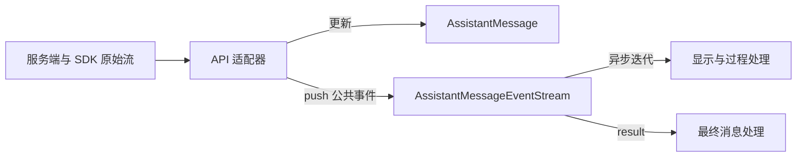

# EventStream：把生成过程和最终结果交给同一个调用方

`EventStream` 解决的是一个具体问题：协议适配器不断产生事件，调用方以自己的速度读取事件，
同时还希望随时等待这一轮生成的最终结果。
它把这两种读取方式放在同一个对象上：`for await...of` 读取过程，`result()` 等待结果。

它不负责调用模型、拼接文本、解析工具参数或执行工具。这些职责分别属于适配器和调用方。
理解这个分工，比先记住队列和泛型更重要。

## 1. 阅读基准与源码入口

本文保留 pi 学习基准 `200387122ca450d6387f033949423114a270b96c` 的设计讲解。
原始学习记录中的工作区 HEAD 为 `b2b5c42f6138b73ec4b2f49ec0ca468800f88586`，不代表当前项目版本。
下表链接指向本项目当前实现；正文中的 `complete`、`streamSimple`、`lazyStream`、
推理、用量和取消能力属于 pi 基准。本项目已实现文本与工具调用事件，以及有四轮上限的加法工具闭环。
本地 `completion(model, context, options)` 按 `model.api` 分发至 OpenAI Chat Completions、Anthropic Messages、OpenAI Responses 或 Google Generative AI，
返回 `Promise<AssistantMessageEventStream>`；取得事件流后消费增量，最终消息通过同一流的 `result()` 获取。
四个协议模块的 `stream` 则同步返回事件流；入口当前只等待最终消息，不消费增量。

| 文件                                                                | 本文关注的内容                                   |
| ------------------------------------------------------------------- | ------------------------------------------------ |
| [event-stream.ts](../../src/ai/utils/event-stream.ts)               | `FifoQueue`、`EventStream`、助手事件流及工厂函数 |
| [types.ts](../../src/ai/types.ts)                                   | `AssistantMessageEvent` 的字段和事件约定         |
| [openai-completions.ts](../../src/ai/api/openai-completions.ts)     | 真实生产者如何创建、推送和结束事件流             |
| [openai-responses.ts](../../src/ai/api/openai-responses.ts)         | Responses 输出项如何转换为助手事件               |
| [anthropic-messages.ts](../../src/ai/api/anthropic-messages.ts)     | SSE 协议事件如何转换为助手事件                   |
| [google-generative-ai.ts](../../src/ai/api/google-generative-ai.ts) | Google 文本、函数调用和签名如何转换为助手事件    |
| [index.ts](../../src/ai/index.ts)                                   | 本地 `completion` 如何分发请求并返回事件流       |
| [event-stream.test.ts](../../test/ai/utils/event-stream.test.ts)    | FIFO、等待者顺序、结束与结果的本地测试           |

pi 基准中的 `packages/ai/src/models.ts` 和 `packages/ai/src/api/lazy.ts` 分别用于讲解
`complete` 复用 `stream().result()` 及异步准备，本仓库没有这两个模块。

下文的“先有简单实现，再遇到问题”是用于理解设计的教学推演，
不是对 pi 实际开发历史的断言。标为“源码节选”的代码保留原标识符；
标为“教学示例”的名称只属于本文，不是包中的公开接口。

## 2. 从最简单的返回值开始：为什么一个 Promise 不够

假设程序只需要问一句话，等模型全部生成完后再显示答案。
此时，一个返回 `Promise<string>` 的函数就能满足需要：

```ts
// 教学接口示意：不是 pi 的公开函数。
declare function askOnce(question: string): Promise<string>;

const answer = await askOnce("用一句话解释异步迭代");
console.log(answer);
```

现在增加两个真实需求：

1. 终端要在生成过程中立即显示文字，不能等到整段结束。
2. 请求完成后，还要取得完整助手消息，其中包括工具调用、用量和结束原因。

例如一次请求经历：

```text
请求开始
收到“你”
收到“好”
取得最终用量，确认结束原因
最终助手消息：文本“你好”以及本轮元数据
```

Promise 只能从等待状态变为一个结果，不能把“你”“好”和最终结果依次作为多次完成值发出去。
只返回最终字符串，还会丢失内容块和结束状态。

可以改用回调，把增量交给 `onDelta`，再返回最终 Promise。这个方案能够工作。
但随着文本、推理、工具开始／增量／结束都需要被消费，调用方需要一个有类型、可顺序遍历的事件接口。
pi 选择以事件序列承载过程，再给同一个对象附加最终结果入口。

这里不是说回调在技术上做不到，而是要看清 pi 选择的调用合同：

```text
同一轮生成
  ├─ 事件序列：调用方可以边生成边处理
  └─ 最终结果：调用方也可以完全不处理事件，只等待结果
```

## 3. 为什么不直接把 SDK 的流返回出去

在 Completions 适配器中，SDK 返回的 chunk 可以通过 `choice.delta.content` 表示文字，
工具参数则通过另一组字段增量到达。其他 API 的原始事件形状并不相同。

如果直接暴露 SDK 流，显示文字的调用方也要知道每种协议的字段，
获取最终结果时还要各自实现内容累积、结束原因判断和用量转换。
同一个工具调用解析错误就可能在多个调用方中重复出现。

pi 的分工是：



- **适配器**理解上游协议，更新助手消息，并把变化转换为公共事件。
- **事件流**保存或交付这些事件，在终态到来时提供最终消息。
- **调用方**决定显示什么、保存什么，以及是否执行工具并继续请求。

因此统一协议语义的是适配器与 `AssistantMessageEvent`，
`EventStream` 本身只是交付机制。单独写出这个类，还没有完成多协议统一。

## 4. 同一个对象的两种读法

下面是使用本地事件流类型的教学调用方函数。它接收一个已经创建的流，不负责配置或调用真实服务：

```ts
import type { AssistantMessageEventStream } from "../../src/ai/utils/event-stream.ts";

/**
 * 实时输出文本增量，并在生成结束后显示错误或结束状态。
 * @param stream - 已创建的助手消息事件流。
 * @returns Promise 完成表示本轮事件及最终消息已处理。
 * @remarks 错误结果只输出错误说明，不抛出异常；已输出文本会保留。
 */
async function showResponse(stream: AssistantMessageEventStream): Promise<void> {
  for await (const event of stream) {
    if (event.type === "text_delta") {
      process.stdout.write(event.delta);
    }
  }

  const message = await stream.result();
  if (message.stopReason === "error") {
    console.error(message.errorMessage ?? message.stopReason);
    return;
  }

  console.log("\n本轮结束原因：", message.stopReason);
}
```

也可以完全不遍历事件，直接 `await stream.result()`。
基准 `models.ts` 中的 `complete` 正是调用 `this.stream(model, context, options).result()`。
它复用相同生成路径，没有为了“只要最终结果”再维护一套非流式协议实现。

这两个入口不是两次请求。对同一个流对象多次调用 `result()`，得到的是同一个内部 Promise。
但先调用 `stream(...)`，随后另行调用 `complete(...)`，会创建另一次调用，不能用来读取前一个流的结果。

## 5. 一个关键问题：谁先到，事件还是消费者

“收到事件后交给调用方”听起来简单，但实际存在两种顺序。

### 5.1 生产者先到：需要保存事件

```text
生产者 push(A)       此时没有人调用 next()
生产者 push(B)       仍然没有消费者
消费者 next()       应得到 A
消费者 next()       应得到 B
```

没有缓冲队列，A 和 B 就只能丢失，或要求生产者等到有人消费。
当前实现选择缓冲：没有等待者时，`push` 把事件放入 `queue`。

### 5.2 消费者先到：需要保存等待动作

```text
消费者 next()       当前没有事件，返回的 Promise 暂不完成
生产者 push(A)       让这个 Promise 完成，消费者得到 A
```

此时应该保存的不是事件，而是“将来如何唤醒消费者”。
当前实现把等待中的 Promise 的 `resolve` 函数放入 `waiting`。
`push` 找到等待者后直接交付事件，无需先入队再出队。

两条队列的内容并不一样：

| 字段      | 保存什么                            | 何时使用         |
| --------- | ----------------------------------- | ---------------- |
| `queue`   | 已经发生但尚未交付的 `T` 事件       | 生产者比消费者快 |
| `waiting` | 等待下一条事件的 Promise 的完成函数 | 消费者比生产者快 |

这解释了为什么只有一个事件数组还不够。
轮询数组也能等待，但会额外引入轮询间隔、定时器和响应延迟；保存完成函数可以直接唤醒。

## 6. 拆开 EventStream 的实现

### 6.1 `T` 是过程，`R` 是结果

源码中的类签名是：

```ts
export class EventStream<T, R = T> implements AsyncIterable<T>
```

`T` 表示每次迭代得到的事件，`R` 表示 `result()` 的结果。
`R = T` 只是没有显式传入第二个类型参数时的默认值，并不要求两者永远相同。

对助手生成来说：

```text
T = AssistantMessageEvent
R = AssistantMessage
```

`text_delta` 是过程中的变化，完整 `AssistantMessage` 才是结果。
这两个类型如果强行合并，调用方就不得不把“一个事件”和“一整轮结果”混为一谈。

### 6.2 构造时就创建最终 Promise

源码节选：

```ts
constructor(isComplete: (event: T) => boolean, extractResult: (event: T) => R) {
  this.isComplete = isComplete;
  this.extractResult = extractResult;
  this.finalResultPromise = new Promise((resolve) => {
    this.resolveFinalResult = resolve;
  });
}
```

这里把 Promise 与它的完成函数分开保存：调用方拿 Promise 等待，生产者通过完成函数交付结果。
Promise 的执行器会立即运行，所以构造结束后，`resolveFinalResult` 已经有值。
字段声明中的 `!` 是 TypeScript 的确定赋值断言，没有额外的运行时等待作用。

两个函数参数让通用类不用知道 LLM 事件名称：

- `isComplete(event)`：这一条是否代表最终事件？
- `extractResult(event)`：如果是，从中取出哪个值交给 `result()`？

它们是生产者提供的规则。通用类不验证工具顺序，也不检查是否先发过 `start`。

### 6.3 `push`：先处理终态，再交付事件

源码节选，注释改为中文：

```ts
push(event: T): void {
  if (this.done) return;

  if (this.isComplete(event)) {
    this.done = true;
    this.resolveFinalResult(this.extractResult(event));
  }

  // 有消费者等待就直接交付，否则保存事件。
  const waiter = this.waiting.dequeue();
  if (waiter) {
    waiter({ value: event, done: false });
  } else {
    this.queue.enqueue(event);
  }
}
```

注意三个细节：

1. 终态事件会先解析最终 Promise，所以不消费事件也能得到结果。
2. 终态事件本身仍要交付给消费者，没有被内部处理“吃掉”。
3. `done` 变为 `true` 之后的 `push` 被忽略，不会追加第二个终态或迟到增量。

第 2 点容易被两个同名概念干扰：

```text
业务事件：{ type: "done", ... }                  表示本轮模型生成完成
迭代结果：{ value: 该业务事件, done: false }      表示本次仍有一条事件可以读取
下次迭代：{ value: undefined, done: true }       表示事件序列没有下一项
```

这里的 `done: false` 并不表示模型还没生成完，而是表示迭代器交付的这一项是有效数据。

### 6.4 异步迭代：优先排空队列，再判断结束

源码节选：

```ts
async *[Symbol.asyncIterator](): AsyncIterator<T> {
  while (true) {
    if (this.queue.length > 0) {
      yield this.queue.dequeue()!;
    } else if (this.done) {
      return;
    } else {
      const result = await new Promise<IteratorResult<T>>((resolve) => this.waiting.enqueue(resolve));
      if (result.done) return;
      yield result.value;
    }
  }
}
```

`[Symbol.asyncIterator]` 让对象能被 `for await...of` 使用，`async *` 表示返回异步生成器。
`yield` 交出一条事件后暂停这个生成器；消费者请求下一项时才继续执行。
这暂停的是事件交付循环，不是独立运行的 SDK 请求。

这里必须先检查 `queue`，再检查 `done`。
例如生产者已经推入 A、B 和终态，此时内部 `done` 已经为真，队列却仍有三条未读事件。
如果先判断 `done` 并退出，慢消费者会丢掉所有缓冲内容。

`queue.length` 检查与随后登记等待者之间没有 `await`；
Promise 的执行器也立即运行。因此在同一 JavaScript 执行线程里，不会在这个间隙漏掉一次 `push`。
这里无需为普通事件循环并发引入线程锁，但也不是可直接跨线程共享的同步队列。

### 6.5 `end` 与 `result`：结束迭代和交付结果是两个动作

`result()` 的源码非常直接：

```ts
result(): Promise<R> {
  return this.finalResultPromise;
}
```

`end(result?)` 则做三件事：设置内部 `done`；有非 `undefined` 的参数时解析最终 Promise；
将所有等待中的读取完成为 `{ value: undefined, done: true }`。
它不清空已缓冲事件，也不生成业务 `done` 事件。

| 生产者动作                        | 最终 Promise   | 事件读取                           |
| --------------------------------- | -------------- | ---------------------------------- |
| `push(普通事件)`                  | 不变           | 交付或缓冲这一项                   |
| `push(终态事件)`                  | 从事件提取结果 | 终态也作为一项交付或缓冲           |
| `end(result)`，参数非 `undefined` | 交付显式结果   | 唤醒等待者结束，保留缓冲事件供读取 |
| 还没有结果时调用 `end()`          | 仍未完成       | 迭代可以结束                       |
| 已推送终态后调用 `end()`          | 保留原结果     | 唤醒剩余等待者                     |

因此，只调用 `end()` 不能保证 `await result()` 返回。
pi 基准测试中“无结果结束”验证的是等待者被唤醒；本地测试还明确断言最终 Promise 继续等待，
直到后续调用 `end(result)` 补交结果。
泛型即使允许 `R` 为 `undefined`，当前 `end(undefined)` 也不会主动完成最终 Promise。

另一个细节是：`push(终态)` 只向一个等待者交付该事件，
不会顺便遍历所有等待者。单消费者随后能自行看到结束；若还有其他等待者，`end()` 才负责全部唤醒。
这也是为什么不能把生产者末尾的 `end()` 一概当成重复代码删掉。

## 7. FifoQueue 为什么用两个数组

两条内部队列都使用同一个私有 `FifoQueue`。它不是公开 API。
源码中的出队过程：

```ts
dequeue(): T | undefined {
  if (this.outgoing.length === 0) {
    while (this.incoming.length > 0) {
      this.outgoing.push(this.incoming.pop()!);
    }
  }
  return this.outgoing.pop();
}
```

入队只做 `incoming.push(value)`。出队时，如果 `outgoing` 为空，
把 `incoming` 反向搬过去，再从末尾 `pop`。

```text
依次放入 A、B、C：
incoming = [A, B, C]，outgoing = []

第一次出队前搬运：
incoming = []，outgoing = [C, B, A]
pop 得到 A，剩下 [C, B]

此时新放入 D：
incoming = [D]，outgoing = [C, B]
随后依次得到 B、C，最后才搬运并取出 D
```

这样既保持 FIFO，又避免反复从数组头部删除造成元素搬移。
一次搬运可能处理很多元素，但每个元素只经过有限次入栈、搬运和出栈，总体是摊还常数时间。
不能说每一次 `dequeue` 的最坏耗时都是常数。

这是队列实现的性能选择，不是流式接口成立的前提。
手敲初版时可以先理解普通数组队列；对齐固定源码时，再补上这个实现和顺序测试。
优化队列操作也不等于限制队列容量，后者是另一项能力。

## 8. AssistantMessageEventStream 加了什么

通用类不知道哪条事件是最终结果，助手专用子类只提供这一规则。
源码节选：

```ts
export class AssistantMessageEventStream extends EventStream<
  AssistantMessageEvent,
  AssistantMessage
> {
  constructor() {
    super(
      (event) => event.type === "done" || event.type === "error",
      (event) => {
        if (event.type === "done") {
          return event.message;
        } else if (event.type === "error") {
          return event.error;
        }
        throw new Error("Unexpected event type for final result");
      },
    );
  }
}
```

它没有重新实现队列，也没有新增文本拼接器。
`createAssistantMessageEventStream()` 工厂同样只是返回一个该子类实例，供扩展使用。

### 8.1 失败也是一种最终消息

`error` 事件的 `error` 字段类型是 `AssistantMessage`，不是 JavaScript `Error`。
该消息可以保留失败前已经产生的内容，以及 `stopReason`、`errorMessage` 等字段。

所以正常适配器发出的失败事件会让 `result()` **兑现为失败消息**，不会自动拒绝 Promise。
只用 `try/catch` 包住 `await stream.result()`，然后把所有返回值都当成功，是错误的消费方式。
应检查最终消息的结束原因，或在过程消费时处理 `error` 事件。

这不等于所有入口都永不抛异常。例如 `types.ts` 明确说明，直接调用 `streamSimple()` 时缺少认证
可能同步抛错；通用 `EventStream` 也不会替任意生产者捕获所有异常。
要区分“创建流之前抛错”和“已经创建的流以错误消息结束”。

### 8.2 公共事件是约定，不是由这个类执行的状态机

成功文本生成通常可以表示为：

```text
start
text_start(contentIndex = 0)
text_delta(contentIndex = 0, delta = "你")
text_delta(contentIndex = 0, delta = "好")
text_end(contentIndex = 0, content = "你好")
done(reason = "stop", message = 完整助手消息)
```

这是教学事件序列，不是一次真实服务抓包。`contentIndex` 指向助手消息内容数组中的块，
不是 SDK chunk 的序号。本地工具调用使用 `toolcall_start`、`toolcall_delta` 和 `toolcall_end`；
OpenAI 与 Anthropic 的 `toolcall_delta.delta` 是参数原文片段；Google 的对应事件包含单个函数调用参数对象的 JSON 字符串。
`toolcall_end` 不表示已通过参数校验。
Chat Completions 在响应流读取完毕后发送内容结束事件；Anthropic 在对应 `content_block_stop` 时发送，
Responses 在对应 `response.output_item.done` 时发送内容结束事件；Google 每个函数调用立即发送开始、参数及结束事件，并结束此前文本块，后续文本另建块；
这些事件都不表示整次请求已成功，仍需等待 `done` 或 `error`。推理事件属于 pi 基准。

请求建立前失败可以直接产生 `error`，无需伪造一个 `start`；
开始之后失败则以 `error` 结束，不应伪装成正常 `done`。
但这些规则由类型文档、适配器和测试共同保证，`EventStream.push` 不会检查整个事件序列是否合法。

## 9. 回到真实生产者：它如何与异步请求配合

Completions 的 `stream` 函数同步创建并返回 `AssistantMessageEventStream`，
同时启动一个异步函数执行网络请求。按源码执行顺序，可以画成：

```text
stream(model, context, options)
  创建 AssistantMessageEventStream
  准备规范化上下文
  启动异步生成过程
    创建 output 消息，初始 stopReason 为 pending
    创建客户端、构造请求并等待响应
    push(start)
    遍历 SDK chunk
      更新 output 内容／用量／元数据
      push 对应公共事件
    检查终止状态
    push(done) 或在捕获错误后 push(error)
    end()
  同步返回事件流对象
```

“同步返回”不表示网络已经完成；异步函数遇到等待时，调用方就能拿到流并开始消费。
由于生产者独立推进，即使调用方只读 `result()`，请求仍会执行。

源码中处理文本增量的核心节选是：

```ts
const block = ensureTextBlock();
block.text += choice.delta.content;
stream.push({
  type: "text_delta",
  contentIndex: getContentIndex(block),
  delta: choice.delta.content,
  partial: output,
});
```

这里可以直接回答“谁拼出最终文本”：是适配器中的 `block.text += ...`，不是事件流。
`ensureTextBlock()` 在首次出现文本时创建块并推送 `text_start`。
正常结束时，适配器推送 `done` 并调用 `end()`；异常路径更新 `output` 的错误状态后，
推送 `error` 并调用 `end()`。缺少结束原因等协议错误也在适配器中判定。

`lazyStream` 使用同样的思路：先同步返回外层事件流，再异步准备认证或加载模块，
随后转发内层事件；准备失败时构造失败消息并结束外层流。
这解释了为什么事件流还可以连接异步初始化，而不只连接 SDK chunk。

## 10. 最容易误用的四个边界

### 10.1 `partial` 是共享对象，不是历史快照

适配器把同一个 `output` 放进多条事件的 `partial`，而 `push` 不做深拷贝。

```text
t1：push(text_start，partial 指向 output)，此时文本为空
t2：output 中的文本增加“你”
t3：output 中的文本增加“好”
t4：慢消费者才读取 t1 的事件，看到的 partial 中可能已经是“你好”
```

因此，不能把每个事件的 `partial` 当成“事件发生时的状态”，也不要修改它。
若要逐段追加文字，使用 `text_delta.delta`；若要显示当前整条消息，可以从 `partial` 读取当前状态。
不要先追加 `partial` 中的完整文字，又追加同一批 `delta`，否则会重复显示。

把整个事件放进数组也不会自动得到快照；即使读取时复制，得到的也只是读取时状态。
跨进程重建需要专门处理快照与增量的重叠，pi 学习资料中的
`packages/ai/src/utils/assistant-message-frame.ts` 就处理这个问题；本项目尚未实现该模块。

### 10.2 多个迭代器会分配事件，不会各自得到全量

每次调用 `[Symbol.asyncIterator]()` 会创建一个生成器，但它们共享 `queue` 和 `waiting`。
一条事件只会被一个读取动作取走。

```text
界面迭代器等待下一项
日志迭代器等待下一项
push(A) → 界面得到 A
push(B) → 日志得到 B
```

这不是广播订阅。原有测试明确验证等待者按登记顺序获得不同事件。
若界面和日志都要看完整序列，应由一个消费者读取，再显式把事件交给两者。
多个地方等待同一个 `result()` 不会争抢最终结果，Promise 可以被多次等待。

### 10.3 没有背压，消费慢会积压

背压指下游处理不过来时，让上游放慢或暂停。
当前 `push` 返回 `void`，没有容量上限，也没有等待消费者确认；适配器不会因此暂停读取 SDK。
所以不能因为消费者写了 `await`，就认为模型生成速度也会随之降低。

只等 `result()` 时，事件仍然入队，不会自动关闭事件生产或丢弃过程数据。
有限的一轮响应能够这样使用，但它不是无限长度数据流的恒定内存方案。
有容量限制、主动丢弃策略或广播需求时，需要另行设计，不能把这些能力说成当前实现已有。

### 10.4 停止读取、关闭队列和取消请求不是同一件事

消费者 `break` 退出循环，只停止这个生成器的继续读取；
`EventStream` 没有在迭代器退出时取消请求的逻辑。
生产者调用 `end()` 也只是结束事件交付，不会向 SDK 发取消信号。

pi 基准中的请求取消由调用方传入的 `AbortSignal` 与适配器处理。
适配器随后把取消表示为 `reason: "aborted"` 的错误事件，并保留部分消息。
所以想取消生成，应该通过请求的中止控制器完成，不能仅退出显示循环。
本地 `StreamOptions` 尚未提供取消信号，结束状态也不包含 `aborted`。

## 11. 不调用 API 的完整运行示例

下面调用仓库中的真实 `EventStream`，没有重新实现这个类。
`DemoEvent`、`produceGreeting` 是教学示例名称；事件数据由本地代码产生，不代表真实 API 验证。

将代码保存为仓库内的 `docs/desin/event-stream-demo.ts` 后，在仓库根目录运行：

```sh
node docs/desin/event-stream-demo.ts
```

本例使用 Node.js 的 TypeScript 类型剥离能力，验证环境为 Node.js `v25.9.0`。
本次交付只新增文档，不额外保留该示例文件。完整示例代码如下：

```ts
import assert from "node:assert/strict";
import { EventStream } from "../../src/ai/utils/event-stream.ts";

type DemoEvent = { type: "delta"; delta: string } | { type: "done"; text: string };

function produceGreeting(): EventStream<DemoEvent, string> {
  const stream = new EventStream<DemoEvent, string>(
    (event) => event.type === "done",
    (event) => {
      if (event.type !== "done") throw new Error("只能从终态事件提取结果");
      return event.text;
    },
  );

  // 让调用方先拿到流；这里没有网络请求，也不模拟网络耗时。
  queueMicrotask(() => {
    let text = "";
    for (const delta of ["你", "好"]) {
      text += delta;
      stream.push({ type: "delta", delta });
    }
    stream.push({ type: "done", text });
    stream.end();
    stream.push({ type: "delta", delta: "这条不会被交付" });
  });

  return stream;
}

// 一：同一轮生成同时提供事件序列与最终结果。
const stream = produceGreeting();
const finalResult = stream.result();
assert.equal(stream.result(), finalResult);
const events: DemoEvent[] = [];
for await (const event of stream) events.push(event);
assert.deepEqual(events, [
  { type: "delta", delta: "你" },
  { type: "delta", delta: "好" },
  { type: "done", text: "你好" },
]);
assert.equal(await finalResult, "你好");

// 二：不先消费事件也能拿结果，之后仍可排空缓冲事件。
const resultOnly = produceGreeting();
assert.equal(await resultOnly.result(), "你好");
const buffered: DemoEvent[] = [];
for await (const event of resultOnly) buffered.push(event);
assert.deepEqual(buffered, events);

// 三：两个等待者获得不同事件；结束会唤醒剩余等待者。
const shared = new EventStream<number, number>(
  (event) => event === 3,
  (event) => event,
);
const first = shared[Symbol.asyncIterator]();
const second = shared[Symbol.asyncIterator]();
const firstPending = first.next();
const secondPending = second.next();
shared.push(1);
shared.push(2);
assert.deepEqual(await firstPending, { value: 1, done: false });
assert.deepEqual(await secondPending, { value: 2, done: false });

const terminalPending = first.next();
let otherFinished = false;
const otherPending = second.next().then((result) => {
  otherFinished = true;
  return result;
});
shared.push(3);
assert.deepEqual(await terminalPending, { value: 3, done: false });
assert.equal(await shared.result(), 3);
assert.equal(otherFinished, false);
shared.end();
assert.deepEqual(await otherPending, { value: undefined, done: true });

// 四：无结果 end() 可以关闭迭代，但不会完成 result()。
const closed = new EventStream<number, string>(
  () => false,
  (event) => String(event),
);
let resultResolved = false;
const closedResult = closed.result().then((value) => {
  resultResolved = true;
  return value;
});
closed.end();
assert.deepEqual(await closed[Symbol.asyncIterator]().next(), { value: undefined, done: true });
assert.equal(resultResolved, false);
closed.end("后来显式提供的结果");
assert.equal(await closedResult, "后来显式提供的结果");

// 五：队列保存对象引用，而不是对象的历史副本。
const partial = { text: "" };
const references = new EventStream<{ partial: { text: string } }, string>(
  () => false,
  () => "",
);
references.push({ partial });
partial.text = "你好";
references.end("结束");
for await (const event of references) {
  assert.equal(event.partial, partial);
  assert.equal(event.partial.text, "你好");
}

console.log("通过：过程与结果、缓冲、等待者分配、结束语义和共享引用。");
```

第四组断言还揭示了一个细节：`end` 没有因为内部 `done` 已为真就立即返回，
所以首次 `end()` 未给结果时，后续 `end(result)` 仍可补交结果。
反之，已经兑现的 Promise 不会被第二次结果覆盖。
实际助手适配器应按合同发送终态，不应依赖“先关流，之后某处再补结果”维持正常请求生命周期。

## 12. 怎么判断自己已经理解

先不用看代码回答以下问题，再用源码或示例验证：

1. 终态已经推入，为什么消费者还能继续读到此前缓冲的事件？
2. `result()` 为什么不依赖 `for await` 帮它把文本拼完？
3. 为什么模型的 `done` 事件对应迭代结果中的 `done: false`？
4. 两个页面模块分别遍历同一个流，为什么不能保证都显示完整内容？
5. 为什么 `end()` 后迭代结束了，另一个函数却还停在 `await result()`？
6. 为什么开始事件发出时内容为空，后来读它的 `partial` 却能看到完整文本？

独立练习：不修改 `EventStream`，写一个消费函数，只遍历一次流，
同时把文字增量交给显示函数，把事件类型记到日志，最后返回完整结果。
再加入一次生产者错误终态，说明哪些信息仍能保留，以及调用方如何区分成功和失败。
不要用第二个独立迭代循环给日志分流。

排查练习：某适配器异常后只调用了 `end()`，页面停止刷新，但 `complete()` 一直不返回。
沿“适配器 → 终态事件 → 最终 Promise”定位缺失动作，
解释为什么给调用方加一个超时不能修复生产者违反结束合同的问题。

## 13. 本文验证与学习位置

原始 pi 学习记录包含 `packages/ai/test/event-stream.test.ts` 的 5 项测试及完整示例的验证结果，
这些历史结果不作为当前项目的验证依据。
本地事件流测试位于 `test/ai/utils/event-stream.test.ts`，包含 6 项测试；
在仓库根目录运行 `npm test` 可连同补全接口、配置和入口测试一起验证，第 11 节示例也可独立运行。
这些检查不调用真实服务，不代表其他 API 的端到端行为已经验证。

这份设计对应 [阶段功能记录](../stage-progress.md) 中阶段 2 的核心内容。
本地工具调用及加法执行闭环记录在阶段 3，Anthropic 接入与协议分发记录在阶段 4，Responses 接入记录在阶段 5，Google 接入记录在阶段 6；
pi 学习资料中的取消、事件帧和延迟加载属于扩展主题，
不代表本项目已实现这些能力。
阅读本篇时先掌握两个队列、两种读取方式和明确的生产者职责。
