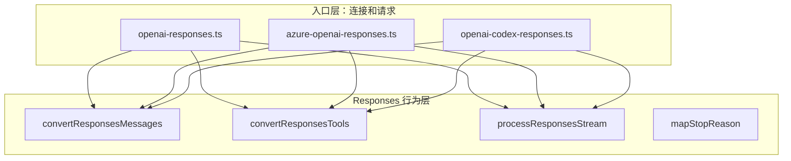

# Responses 的文件组织：本地单文件与 pi 共享模块

本项目阶段 5 在 `src/ai/api/openai-responses.ts` 中完成请求构造、历史转换、工具转换及响应事件处理。
当前只有一个 Responses 请求入口，只有 `stream` 对外导出，内部函数不需要提前移动到共享文件。

本文原有的 pi 学习记录讨论 `openai-responses.ts` 与 `openai-responses-shared.ts` 的拆分，
其目标是让多个 Responses 入口复用相同的输入和事件算法。文件拆分属于复用边界，不是协议要求。
本项目保留函数之间的职责边界，尚未实现记录中的 Azure、Codex、WebSocket 或其他扩展入口。

## 1. 阅读基准与本地源码入口

原文记录的 pi 学习基准为 `200387122ca450d6387f033949423114a270b96c`，
当时记录的工作区 HEAD 为 `b2b5c42f6138b73ec4b2f49ec0ca468800f88586`。
本阶段没有提供对应 pi 源码或 `ORIGIN.md`，以下第 2 至 14 节保留为历史学习摘录，
其中的阶段 05、`packages/ai`、shared 导出和其他入口均指原记录，未在本阶段重新核验，
不代表本项目当前目录、接口或已实现功能。教学示例依赖原上下文，不能直接作为本地接口调用。

以下链接指向本项目实际源码与测试：

| 文件                                                        | 当前职责                                               |
| ----------------------------------------------------------- | ------------------------------------------------------ |
| [openai-responses.ts](../../src/ai/api/openai-responses.ts) | 请求构造、Responses 历史与工具转换、输出槽位和终态处理 |
| [index.ts](../../src/ai/index.ts)                           | 按四种 `model.api` 同步分发事件流及等待最终消息        |
| [types.ts](../../src/ai/types.ts)                           | 公共消息、文本签名、响应标识与助手事件                 |
| [hash.ts](../../src/ai/utils/hash.ts)                       | 将过长的历史消息项标识转换为确定性短标识               |
| [responses.test.ts](../../test/ai/responses.test.ts)        | 模拟请求、事件回放、历史转换及错误边界                 |

### 1.1 本地实现与原记录的区别

| 关注点   | 原 pi 学习记录                                                  | 本地实现                                                                                                     |
| -------- | --------------------------------------------------------------- | ------------------------------------------------------------------------------------------------------------ |
| 模块组织 | 多个 Responses 入口使用 shared 模块                             | 单一 `openai-responses.ts`，没有 shared 文件                                                                 |
| 转换函数 | shared 导出 `convertResponsesMessages`、`convertResponsesTools` | 同名函数保持模块私有，只由本模块构造请求时调用                                                               |
| 事件处理 | shared 的 `processResponsesStream`                              | 本地私有 `processResponsesStream`，处理输出项、助手消息与公共事件流                                          |
| 调用入口 | 原记录包含多个连接和传输入口                                    | `stream` 同步返回事件流；`complete` 返回最终助手消息的 Promise                                               |
| 请求能力 | 原记录讨论认证、取消、用量及其他能力                            | 支持密钥、`headers`、`maxTokens`、`temperature`、`fetch` 及协议模块的 `toolChoice`；没有取消、推理或用量事件 |

本地 `buildParams` 将上下文转为 `input`，设置 `stream: true`、`store: false`，
工具使用 `strict: false`；请求禁用自动重试。请求上限校验为非负有限整数，
正值发送为 `max_output_tokens` 并提升到至少 16，省略或为 0 时不设置，也不读取 `Model.maxTokens`。
温度校验为 0 到 2 之间的有限数值。调用方通过 `OpenAIResponsesOptions` 指定该协议的请求选项；`TextSignatureV1` 描述文本签名结构。

本地 `outputSlots` 按协议 `output_index` 关联文本或工具内容块，其 `contentIndex` 指向助手内容数组。
`response.function_call_arguments.done` 用最终原文替换累计参数；
只有最终原文以累计原文为前缀时，才补发尚未交付的尾部增量。
`response.output_item.done` 完成文本签名或工具参数，发送内容结束事件并删除槽位。

`ToolCall.id` 保存为 `call_id|item.id`，工具结果回填时只取 `call_id`；
历史 `function_call.id` 要求输出项标识以 `fc_` 开头；供应商与协议均相同但模型标识不同时清除该标识。
工具的 `namespace` 仅在供应商、协议及模型标识全部一致时回传。
文本 `textSignature` 保存 `{ v: 1, id, phase? }` 的 JSON 字符串，历史转换也接受旧版纯字符串标识；
缺失标识使用 `msg_pi_` 前缀的本地回退标识，超过 64 字符的标识通过 `shortHash` 缩短。
该散列不提供密码学安全或唯一性保证。`responseId` 只记录响应标识，没有自动会话续接。

必须收到 `response.completed`、`response.incomplete` 或 `response.failed` 终态，
正常完成且包含工具内容时返回 `toolUse`，`incomplete.max_output_tokens` 返回 `length`；
其他未完成原因及失败事件转为错误消息。正常工具终态留有未结束参数原文时报告协议错误。
截断的工具调用保留部分参数并清理内部字段，不伪造 `toolcall_end`；调用方仍须校验后才能执行。
拒绝增量作为文本处理，工具由入口执行，事件流只负责交付。

## 2. 先从一个文件实现：它完全可以工作

如果只有一个 Responses 入口，最直接的结构可以是：

```text
openai-responses.ts
  ├─ createClient
  ├─ buildParams
  ├─ convertResponsesMessages
  ├─ convertResponsesTools
  ├─ processResponsesStream
  └─ stream
```

这个结构没有功能错误。请求入口可以这样组织：

```ts
// 教学示例，省略认证、错误和完整类型。
export async function stream(model: Model, context: Context): Promise<void> {
  const params = {
    model: model.id,
    input: convertResponsesMessages(model, context),
    tools: convertResponsesTools(context.tools ?? []),
    stream: true,
  };

  const response = await client.responses.create(params);
  await processResponsesStream(response, output, eventStream);
}
```

阶段 05 的参考工程也没有因为拆分文件才获得这些能力。它保留的是基准算法和公共类型的连接，
文件拆分只是组织方式。

所以第一个结论是：

> `openai-responses-shared.ts` 不是 Responses 协议的运行时必需品，而是多个 Responses 入口之间的复用边界。

## 3. 第二个入口出现后，重复代码暴露问题

原 pi 学习记录描述以下入口引用共享模块：

```text
openai-responses.ts        ─┐
azure-openai-responses.ts  ─┼─→ openai-responses-shared.ts
openai-codex-responses.ts  ─┘
```

它们都使用以下函数：

```text
convertResponsesMessages
convertResponsesTools
processResponsesStream
```

但入口本身并不相同：

| 入口                     | 入口侧差异                                      | 可以共享的部分                          |
| ------------------------ | ----------------------------------------------- | --------------------------------------- |
| `openai-responses`       | OpenAI 客户端、普通 Responses URL、普通 API Key | Responses 输入项和响应事件语义          |
| `azure-openai-responses` | Azure 客户端、部署名称、Azure 请求配置          | 输出槽位、工具参数增量、终止状态处理    |
| `openai-codex-responses` | Codex URL、SSE／WebSocket、连接会话处理         | 同一套 Responses 输出项到公共消息的转换 |

如果把共享函数复制到三个入口中，表面上每个文件都“自包含”，实际会出现三个问题。

### 3.1 修复必须同步修改多份

假设发现一个 Responses 事件可能在 `response.output_item.added` 时创建工具调用，
随后在 `response.function_call_arguments.done` 中又带来完整参数。
如果三个入口各自维护处理器，就必须在三处都修复“只追加尚未发送的参数尾部”这一逻辑。

漏改一个入口，就会出现：

```text
OpenAI：工具参数正确
Azure：参数重复
Codex：工具参数缺失
```

这种差异不是服务能力差异，而是复制实现产生的维护错误。

### 3.2 协议语义会被入口配置污染

入口文件还要处理部署名称、认证、端点、请求覆盖和连接方式。
如果它同时包含所有输出事件细节，阅读者很难判断一段代码是在解决：

```text
“Azure 如何定位部署？”
还是
“Responses 的 output_index 如何关联内容块？”
```

把共同行为提取出来，可以让入口集中表达“怎么连接服务”，共享模块集中表达“Responses 事件是什么意思”。

### 3.3 测试无法清楚表达责任边界

共享处理器可以用合成的 `AsyncIterable<ResponseStreamEvent>` 测试，
不需要每个用例都创建 OpenAI、Azure 或 WebSocket 客户端。
入口测试则专门检查端点、参数和认证。

这样一个失败更容易定位：

```text
事件序列回放失败 → processResponsesStream 或输入事件数据
请求 URL 错误     → 对应入口的 createClient 或 buildParams
```

## 4. 原包的两个层次：入口层和协议行为层

可以把原包中的关系画成两层：



这不是“公共基础设施层”和“所有 API 层”的关系。
`openai-responses-shared.ts` 仍然是 Responses 专用代码，里面可以直接使用
`ResponseInput`、`ResponseOutputItem`、`ResponseStreamEvent` 等 Responses 类型。
它没有试图抽象成 Completions、Anthropic 和 Google 都能直接调用的协议中立模块。

这点很重要：

```text
EventStream                  → 公共事件交付机制，可被多个 API 使用
AssistantMessageEvent        → 公共助手事件语义
openai-responses-shared.ts   → Responses 家族内部共享的协议算法
```

共享文件的“shared”是相对 Responses 家族而言的，不代表整个 `packages/ai` 都依赖它。

## 5. `openai-responses.ts` 具体留下什么

以普通 OpenAI Responses 入口为例，`openai-responses.ts`
主要承担四类入口职责。

### 5.1 创建流对象和助手结果

`stream` 先创建 `AssistantMessageEventStream`，并初始化 `AssistantMessage`。
这决定了调用方拿到的是哪个公共流对象，以及失败时如何结束这一轮。

### 5.2 解析认证和请求级选项

入口需要将 `apiKey`、`baseUrl`、`headers`、`fetch`、`signal`、超时和重试配置交给客户端或请求。
这些值是调用方式和 Provider 配置的一部分，不应由共享 Responses 事件处理器决定。

### 5.3 构造并发送请求

入口调用共享转换函数得到 `input` 和 `tools`，然后设置 Responses 自己的请求字段：

```text
model
input
tools
stream: true
store
max_output_tokens
temperature
tool_choice
```

请求可能通过不同客户端或传输方式发出；共享模块不需要知道 HTTP、SSE 或 WebSocket 的细节。

### 5.4 负责整轮成功和失败的外层边界

入口在共享处理器前后处理：

```text
创建客户端
→ 构造参数
→ 发出请求
→ push(start)
→ 调用 processResponsesStream
→ 检查 pending、error、aborted 等外层状态
→ push(done) 或 push(error)
→ end()
```

共享处理器可以抛出“没有终止事件”或“工具调用未完成”等协议处理错误；
入口负责把异常转换为公共助手错误消息，并完成外层流生命周期。

## 6. `openai-responses-shared.ts` 具体共享什么

### 6.1 `convertResponsesMessages`：公共消息到 Responses 输入项

公共消息和 Responses 输入不是同一个结构。
例如公共用户消息可以是：

```ts
{
  role: "user",
  content: "请计算 2 + 3",
  timestamp: 0,
}
```

Responses 需要输入项和内容块：

```ts
{
  role: "user",
  content: [{ type: "input_text", text: "请计算 2 + 3" }],
}
```

助手工具调用也不能简单当成普通文本。共享转换要保留 `call_id` 和 Responses item ID 的关系，
工具结果则要变成 `function_call_output`：

```text
公共 ToolCall.id = call_id|item_id
              ↓ 拆分
function_call.call_id = call_id
function_call.id      = item_id

公共 ToolResultMessage.toolCallId = call_id|item_id
              ↓ 取调用部分
function_call_output.call_id = call_id
```

这样模型下一轮才能知道结果属于哪个调用。
不同入口虽然认证和端点不同，但只要接收的都是 Responses 输入项，
这套身份转换就不应该复制三份。

### 6.2 `convertResponsesTools`：公共工具声明到 Responses 工具

公共工具声明包含名称、描述和 JSON Schema；Responses 需要自己的 function tool 结构。
共享转换还要根据入口或模型能力决定 `strict`、grammar 和工具搜索等选项。

概念上的转换是：

```ts
const responseTool = {
  type: "function",
  name: tool.name,
  description: tool.description,
  parameters: tool.parameters,
  strict: false,
};
```

上面是教学示例，不是固定基准中所有分支的完整实现。
真实函数还处理约束采样和特殊工具能力，调用者通过选项表达入口的能力边界。

### 6.3 `processResponsesStream`：事件项到公共助手事件

这是拆分最有价值的部分。Responses 不是简单的“每个 chunk 都带一段文本”，
而是通过不同事件描述输出项和整轮状态。

典型过程如下：

```text
response.created
  → 保存 response.id

response.output_item.added(output_index = 0, item = message)
  → 为 output_index = 0 建立 text slot
  → push(text_start)

response.output_text.delta(output_index = 0, delta = "你好")
  → 找到 slot 0
  → 累积 TextContent.text
  → push(text_delta)

response.output_item.done(output_index = 0, item = message)
  → 写入最终文本签名
  → push(text_end)

response.completed
  → 映射 stopReason
```

工具调用也是同样的槽位思路，只是增量事件和终态事件不同：

```text
response.output_item.added(output_index = 1, item = function_call)
  → 建立 toolCall slot
  → push(toolcall_start)

response.function_call_arguments.delta(output_index = 1, delta = "{\"a\":2")
  → 找到 slot 1
  → 累积 partialJson
  → 解析当前可用参数
  → push(toolcall_delta)

response.function_call_arguments.done(output_index = 1, arguments = "{\"a\":2}")
  → 补齐服务端最终参数

response.output_item.done(output_index = 1, item = function_call)
  → 删除临时 partialJson
  → push(toolcall_end)
```

共享处理器使用 `outputSlots: Map<number, ResponsesOutputSlot>`，
把上游的 `output_index` 映射为公共消息 `contentIndex`。
这正是 Responses 协议的核心算法，不能因为入口换成 Azure 就重新发明一套。

## 7. 为什么要有 output slot，而不是只维护一个当前块

Completions 的某些常见响应可以近似看成“当前 choice 的文本和工具增量”。
Responses 的输出是一个有索引的 item 序列，文本、工具或其他输出项可能按 `output_index` 交错出现。

例如：

```text
output_index = 0：文本“先说明步骤”
output_index = 1：工具调用 get_weather
output_index = 0：文本继续“然后给出结果”
```

如果只保存 `currentBlock`，第二个索引到来时就会覆盖第一个，后续文本无法归属。
槽位表保留这种关系：

```text
Responses output_index 0 ─→ AssistantMessage.content[0]
Responses output_index 1 ─→ AssistantMessage.content[1]
```

`getSlot(outputIndex, type)` 还会检查槽位类型。
收到文本增量时找不到文本槽位，就不能把数据错误地写进工具块。
这种检查属于 Responses 事件处理逻辑，所以放在 Responses shared 模块，而不是通用 `EventStream`。

## 8. 为什么不能把这份 shared 文件给另外两个协议使用

这里的“另外两个协议”是阶段 05 之前已经学习的 `openai-completions` 和 `anthropic-messages`。
它们的事件和输入结构不同，强行共用会导致抽象泄漏。

### 8.1 Completions 的输入和事件不同

Completions 使用消息数组和 `chat.completions.create`，增量通常从 choice delta 中读取：

```text
choice.delta.content
choice.delta.tool_calls[index].function.arguments
choice.finish_reason
```

Responses 则使用 `input` 项和 `response.*` 事件：

```text
response.output_text.delta
response.function_call_arguments.delta
response.completed
```

两者都能映射为 `text_delta` 或 `toolcall_delta`，但“如何判断属于哪个块、何时结束、如何取得 ID”
并不相同。可以共享公共事件类型，不能直接共享 Responses 的事件解析器。

### 8.2 Anthropic 的内容块生命周期不同

Anthropic 通过 `message_start`、`content_block_start`、`content_block_delta`、
`content_block_stop`、`message_delta`、`message_stop` 表达消息和内容块生命周期。
工具结果还位于用户消息的 `tool_result` 内容块中。

如果让 Anthropic 适配器调用 `processResponsesStream`，就必须先把 Anthropic 事件伪造成 Responses 事件，
然后再转回公共事件。这会增加一层没有语义价值的转换，并丢失协议特有的边界。

正确的分层是：

```text
Completions 原始事件 ─→ Completions 适配器 ─┐
Anthropic 原始事件   ─→ Anthropic 适配器   ─┼─→ AssistantMessageEvent
Responses 原始事件   ─→ Responses shared ──┘
```

共享的是公共语义，不是某个协议的原始解析器。

## 9. 为什么其他两个协议可以暂时一个文件

“一个文件”不等于“所有职责混成一个函数”。
`openai-completions.ts` 内部仍然有 `stream`、`buildParams`、`convertMessages`、
`getCompat`、`detectCompat` 等不同职责的函数。
`anthropic-messages.ts` 也将消息转换、请求构造、SSE 读取和事件处理分成独立函数。

当前没有另一个目标入口复用它们完整的协议算法时，函数保持在同一文件有两个好处：

1. 阶段学习者可以顺着一次请求读完“输入转换 → 请求 → 事件 → 结果”。
2. 不会为了抽象一个尚不存在的第二实现，提前定义不稳定的共享参数。

如果将来出现两个真正共享 Completions 事件处理的入口，再考虑提取。
提取的触发条件应是“已有多个调用方和稳定的公共合同”，而不是文件达到某个长度。

## 10. 一个函数何时值得提取为 shared

可以用以下问题判断，而不是机械按协议拆文件。

### 10.1 是否有至少两个真实调用方

如果只有 `openai-responses.ts` 调用，shared 文件只是提前命名。
阶段 05 可以先内联或放在同一个文件中，功能不受影响。

原包中 Azure 和 Codex 也调用同一 Responses 处理器时，提取就有明确收益。

### 10.2 两个调用方是否需要同一语义，而不是碰巧几行相似

下面两段代码都“创建客户端”，但不应因为相似就共享：

```text
OpenAI 客户端：apiKey、baseURL、fetch
Azure 客户端：apiKey、endpoint、deploymentName、api-version
```

它们的共享价值低，因为配置约束和错误边界不同。

相反，下面的处理语义稳定：

```text
output_index → 内容槽位
arguments delta → partialJson → toolcall_delta
response.completed → StopReason
```

它们属于 Responses 事件合同，适合共享。

### 10.3 提取后参数是否仍然清楚

当前 `processResponsesStream` 接收：

```ts
openaiStream: AsyncIterable<ResponseStreamEvent>
output: AssistantMessage
stream: AssistantMessageEventStream
model: Model<Api>
options?: OpenAIResponsesStreamOptions
```

它不接收 OpenAI 客户端、Azure deployment 或 Codex WebSocket。
这说明共享函数的依赖边界相对清楚：只要入口能提供 Responses 事件流，
它就可以复用处理器。

如果为了复用而增加十几个入口回调、客户端对象和条件分支，说明抽象边界不稳定，
此时复制少量代码可能比制造“万能 shared”更容易理解。

### 10.4 是否会把不兼容能力硬塞到同一个函数

共享函数可以接收真实存在的能力差异，例如 `serviceTier`、grammar 工具属性或 `onProviderStreamEvent`。
但不能为了未来可能出现的 API，加入没有调用方的配置字段。
当前函数参数应反映已有入口的实际合同，而不是猜测所有 Responses 变体。

## 11. 阶段 05 的推荐手敲路线

为了看清设计为什么出现，建议按下面顺序，而不是一开始就复制最终目录。

### 第一步：在 `openai-responses.ts` 中完成普通闭环

先写：

```text
初始化 AssistantMessageEventStream
→ 创建 OpenAI client
→ 将用户文本转换为 input
→ 发出 stream 请求
→ 读取文本和工具事件
→ 完成最终响应
```

此时只实现一个入口，重点是理解 `output_index`、`call_id`、`item.id` 和 `response.id` 的区别。

### 第二步：把协议算法分成三个函数

即使仍在同一文件，也先明确三个函数的边界：

```text
convertResponsesMessages  只负责公共历史 → Responses input
convertResponsesTools     只负责工具声明 → Responses tools
processResponsesStream    只负责 Responses events → 公共助手事件
```

入口只负责组装和调用，不让请求认证逻辑进入事件解析函数。

### 第三步：用合成事件回放验证处理器

构造一个本地 `AsyncIterable<ResponseStreamEvent>`，依次回放：

```text
response.created
response.output_item.added
response.output_text.delta
response.output_item.done
response.completed
```

验证得到：

```text
text_start
text_delta
text_end
done
```

再回放工具调用，验证 `toolcall_start`、参数增量、`toolcall_end` 和 `toolUse` 终止原因。
这一步不需要真实 API，也不能把本地回放说成服务验证。

### 第四步：再移动到 `openai-responses-shared.ts`

当函数边界稳定后，再把三个函数和它们真正需要的类型移到 shared 文件。
入口只保留导入和调用：

```ts
import {
  convertResponsesMessages,
  convertResponsesTools,
  processResponsesStream,
} from "./openai-responses-shared.ts";
```

移动文件本身不应改变事件结果。若移动后行为改变，通常说明函数偷偷依赖了入口局部状态，
应该先修正依赖边界，再讨论文件组织。

### 第五步：用第二个入口验证提取是否合理

在当前完整原包中，可以对照 Azure 或 Codex 的调用方式；在本范围学习工程中，
不需要为了证明共享而实现这些额外 API。
重点是能解释：第二个入口提供不同的请求建立方式，但仍能把同一种 Responses 事件流交给共享处理器。

## 12. 一个缩小版调用示例

下面示例只展示依赖关系，不是可直接调用真实服务的完整程序：

```ts
type ResponsesParts = {
  input: ResponseInput;
  tools: OpenAITool[];
};

function buildResponsesRequest(model: Model, context: TranscriptContext): ResponsesParts {
  return {
    input: convertResponsesMessages(model, context, new Set()),
    tools: convertResponsesTools(context.tools ?? []),
  };
}

async function runEntry(
  openaiStream: AsyncIterable<ResponseStreamEvent>,
  output: AssistantMessage,
  stream: AssistantMessageEventStream,
  model: Model,
): Promise<void> {
  await processResponsesStream(openaiStream, output, stream, model);
}
```

这个例子故意没有把客户端放进 `runEntry` 的参数。它表达的边界是：

```text
建立连接和获取事件 → 入口负责
解释 Responses 事件 → shared 负责
交付公共事件和最终消息 → EventStream 与入口共同完成
```

在固定基准的完整签名中，`convertResponsesMessages` 还接收允许工具调用的 Provider 集合和选项；
上例的 `new Set()` 只表示缩小后的教学代码，不能当作完整实现的默认配置。

## 13. 常见误解

### 13.1 “shared 文件就是公共 API 层”

不是。它是 Responses 家族内部模块，依赖 Responses SDK 类型。
公共 API 层是 `AssistantMessage`、`AssistantMessageEvent`、`Provider` 等跨实现合同。

### 13.2 “既然只有一个调用方，拆分就是错误”

不一定。保留原包结构有源码对照价值，也为原记录中已有的其他 Responses 入口提供稳定位置。
但在阶段 05 的教学实现中，合并后再提取更容易理解设计动机。

### 13.3 “文件不同就代表职责完全隔离”

不是。`openai-responses.ts` 仍需初始化公共助手消息并决定何时发送 `start`、`done`、`error`；
shared 处理器也会直接修改 `output` 并推送公共事件。
文件拆分降低了协议入口和事件算法的耦合，不能替代明确的调用合同。

### 13.4 “Completions 和 Responses 都是 OpenAI，所以可以共享事件解析器”

服务商相同不表示 API 协议相同。
`openai-completions` 和 `openai-responses` 的输入项、增量字段、ID 和结束事件不同，
它们共享公共消息语义，但保留各自的协议适配器。

## 14. 如何判断自己已经理解

先不看答案回答：

1. `openai-responses.ts` 和 `openai-responses-shared.ts` 各自负责哪一步？
2. 为什么 `processResponsesStream` 接收 `AsyncIterable<ResponseStreamEvent>`，而不是 OpenAI client？
3. `output_index`、`contentIndex`、`call_id`、`item.id` 和 `response.id` 各自解决什么关联问题？
4. 为什么 Azure 可以复用 Responses 事件处理器，却不能直接复用 OpenAI 客户端创建代码？
5. 为什么 Completions 和 Responses 都能产生 `text_delta`，却不能共享原始事件解析器？
6. 如果阶段 05 只有一个 Responses 入口，先合并文件会损失什么，后提取又能获得什么？

独立练习：在阶段 05 参考工程中暂时把三个 shared 函数移入 `openai-responses.ts`，
只保留函数边界，不改请求和事件行为；运行原有本地检查，再把它们移回 shared 文件。
对比两次事件序列和最终 `AssistantMessage`，解释为什么文件移动本身不应影响结果。

排查练习：OpenAI 入口和 Azure 入口都能产生文本，但 Azure 的工具参数重复。
先判断问题属于“入口建立连接”还是“Responses 事件处理”，再沿 `output_index`、
`partialJson` 和 `function_call_arguments.done` 的流程定位，不要先修改公共事件类型。

## 15. 本地验证方式与范围

当前实现依据本项目源码核对；第 2 至 14 节的 pi 摘录保留原文来源说明，未重新核验固定基准。
本地测试通过公开 `stream`、`complete` 和 `options.fetch` 模拟 SSE 响应，
检查请求、公共事件及同一流的 `result()`，不为测试导出私有处理器。

在仓库根目录运行 `npm test`，Responses 测试涵盖文本与工具事件、最终参数补齐、
签名与历史转换、生成参数及错误结果；具体场景以 [测试源码](../../test/ai/responses.test.ts) 为准。
这些测试不调用真实服务，不代表 OpenAI、Azure 或 Codex 服务已完成端到端验证。

本地阶段交付记录见 [阶段功能记录](../stage-progress.md)，
事件交付机制见 [上一篇设计](01-event-stream.md)，配置字段见 [配置指南](../configuration.md)。
